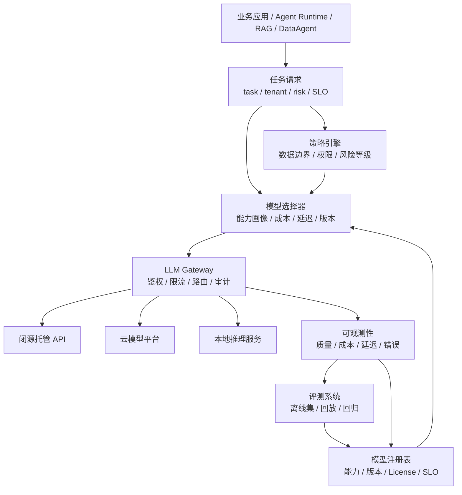
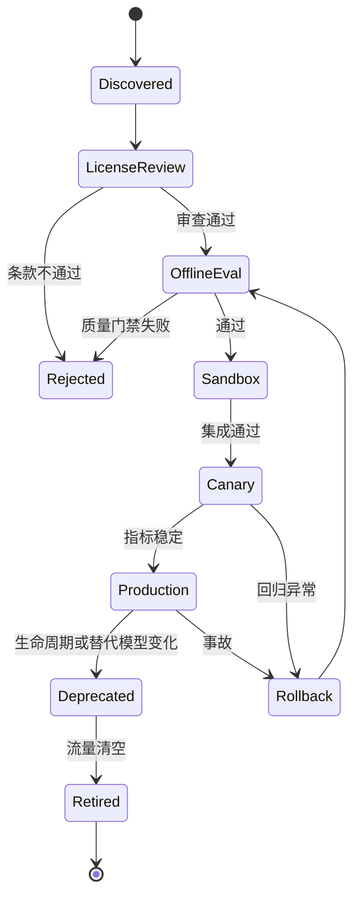

# 第5章 大模型选型

---

企业模型选型不是一次供应商比较，而是一套持续运行的决策系统。客服分类、DataAgent、合同审阅、代码助手和门店离线查询，对质量、延迟、成本、结构化输出、数据边界和版本稳定性的要求完全不同。若仍追求“全公司统一一个最强模型”，低风险任务会承担过高成本，高风险任务又可能缺少足够的推理、审计和回退能力。

**企业真正需要的是模型矩阵：先把任务写成可评测约束，再在合规允许的候选池中按质量、成本、延迟和生命周期做路由，并用线上数据持续校准。** 模型因此应被视为可治理资源，而不是写死在业务代码里的供应商名称。

## 5.1 从任务画像到模型矩阵

一家多业务线企业启动 Agent 平台时，最先要回答的不是“哪个模型排行榜最高”，而是“这个任务到底要求模型做什么”。客服分类需要稳定 JSON、低延迟和低单次成本；DataAgent 更依赖推理、工具调用和 SQL 校验；合同审阅要强调证据、拒答和人工确认；代码助手关心长上下文、补丁和沙箱验证；门店助手则可能把数据本地性放在第一位。

**模型选型的第一步是任务画像，不是模型清单。**

*表5-1：不同业务场景的首要指标、模型倾向与兜底策略。来源：本书整理。*

| 业务场景 | 首要指标 | 模型倾向 | 兜底策略 |
|---|---|---|---|
| 客服工单分类 | JSON 合法率、成本、P95 延迟 | 低成本通用模型或轻量本地模型 | 置信度低时转人工或强模型复判 |
| DataAgent / NL2SQL | SQL 正确率、工具调用可靠性、权限安全 | 推理模型 + 结构化输出能力强的模型 | 执行前校验，失败时强模型修复或人工审核 |
| 合同审阅 | 证据引用、风险分级、拒答边界 | 高能力闭源模型或私有部署强模型 | 强制引用证据，关键结论进入 HITL |
| 内部知识问答 | RAG 事实一致性、长上下文、引用 | 通用模型 + RAG，必要时长上下文模型 | 无证据不回答，改走检索增强 |
| 代码助手 | 代码理解、补丁质量、工具调用 | 代码专用模型或强推理模型 | 沙箱测试、review gate、回滚 |
| 门店离线助手 | 数据本地性、部署成本、响应速度 | 小型开放权重模型、本地推理 | 网络恢复后同步日志和知识库 |


*图5-1：企业模型矩阵与运行时路由。来源：本书自绘。Alt text：左侧是按成本与能力排列的模型池（轻量本地模型、国产托管、全球强模型等），中间是接收任务画像与治理策略的模型网关，右侧是不同业务任务，箭头表示网关按任务把请求路由到合适的模型并保留 fallback。*

企业讨论模型时，经常把“闭源、开放权重、国产、自托管、云平台、推理模型、长上下文、多模态”混成一条轴。实际上它们描述的是不同属性。

*表5-2：闭源托管、开放权重等模型类别的定义与选型须问的问题。来源：本书整理。*

| 概念 | 定义 | 选型时要问的问题 |
|---|---|---|
| 闭源托管模型 | 权重不开放，通过厂商 API 或云平台调用 | 数据能否出域，SLA、价格和版本是否可接受 |
| 开放权重模型 | 权重可下载或私有部署，License 各不相同 | License 是否允许商用，团队能否部署和运维 |
| 国产模型 | 中国团队或中国云服务提供的模型或平台 | 中文能力、采购、本地服务和数据合规是否匹配 |
| 自托管模型 | 企业自己运行权重和推理服务 | 是否具备 GPU、推理引擎、容量和安全隔离能力 |
| 云模型平台 | 通过统一云平台访问多个模型 | IAM、区域、账单、私网和生命周期能否统一管理 |
| 推理模型 | 偏复杂推理、规划、代码和数学 | 任务是否真的需要深推理，能否接受更高延迟和成本 |
| 长上下文模型 | 支持大上下文窗口 | 是否应先用 RAG、摘要和压缩减少输入 |
| 多模态模型 | 同时处理文本、图像、音频或视频 | 多模态证据是否真实存在，输出如何验证 |

“国产”不自动等于合规，“开放权重”也不自动等于低成本。开放权重把 API 成本的一部分换成 GPU、推理优化、容量规划、模型安全、License 审查和运维人力；国产模型仍要按区域、日志、数据分类、合同条款和访问控制做合规判断。

候选模型至少要从任务能力、输出可控性、事实可靠性、性能、成本、数据边界、可运维性和生态兼容性几方面统一评估。

*表5-3：任务能力、成本等候选模型评估维度的关键问题与度量。来源：本书整理。*

| 维度 | 关键问题 | 典型度量 |
|---|---|---|
| 任务能力 | 是否能完成业务任务 | 任务成功率、SQL 正确率、代码测试通过率 |
| 输出可控性 | schema、工具参数或引用是否稳定 | JSON 合法率、tool call 成功率、解析重试率 |
| 事实可靠性 | 是否基于证据，是否容易幻觉 | groundedness、引用命中率、无证据拒答率 |
| 延迟与吞吐 | 是否满足交互或批处理 SLO | TTFT、TPOT、P95/P99、tokens/s |
| 成本 | 单任务和月度总成本是否可控 | token 成本、缓存收益、GPU 利用率 |
| 数据边界 | 数据是否能进入该供应商或区域 | 数据分类、出域策略、日志留存、审计 |
| 可运维性 | 是否能限流、灰度和回滚 | 错误率、version pinning、降级策略 |
| 生态兼容 | 是否支持现有 SDK 和推理栈 | OpenAI 兼容 API、推理引擎与 Tokenizer 兼容性 |

任务画像则把业务需求翻译成这些可评测约束。

*表5-4：把任务需求写成可评测约束的提问清单与示例。来源：本书整理。*

| 问题 | 示例答案 |
|---|---|
| 输入是什么 | 用户问题 + 表结构 + 权限上下文 |
| 输出给谁消费 | DataAgent Runtime 和前端图表 |
| 输出是否机器消费 | 是，需要查询计划和 SQL 草稿 |
| 失败成本多高 | 中高，错误 SQL 可能误导经营决策 |
| 是否包含敏感数据 | 是，包含销售、库存和会员聚合数据 |
| 延迟目标 | P95 30 秒内返回可解释结果 |
| 可否人工介入 | 可以，敏感查询需要确认 |
| 是否需要本地部署 | 生产数据默认不出内网 |

公开 benchmark 可用于初筛，但企业最终应使用自己的任务样本。**榜单回答“模型一般有多强”，企业评测回答“这个模型能否在我的数据、SLO 和风险边界里稳定工作”。**

## 5.2 模型选择必须进入运行时

模型矩阵如果只存在 Excel 中，就无法控制真实调用。生产系统应让业务只声明任务、租户、风险等级、数据分类、SLO 和能力要求，再由 Policy、Model Selector 和 LLM Gateway 决定实际模型。



**业务代码不应写死 `model="某个厂商最新模型"`；模型名是运行时路由结果，而不是应用契约。** 平台至少需要同时支持三种模式。

*表5-5：显式、规则与自动三种模型路由模式及适用场景。来源：本书整理。*

| 模式 | 说明 | 适用场景 |
|---|---|---|
| 显式模型 | 指定某个模型版本 | 离线评测、回归测试、问题复现 |
| 策略路由 | 业务声明任务画像，由平台选模型 | 生产默认模式 |
| 多模型仲裁 | 多模型生成或复判，再投票/裁决 | 高风险合同、SQL 修复、质检抽检 |

一次路由决策背后，需要模型目录、能力画像、策略、选择器、供应商适配、发布控制和成本质量监控共同参与。

*表5-6：模型目录、策略引擎与路由契约的职责、输入输出与失败模式。来源：本书整理。*

| 组件 | 职责 | 主要失败模式 |
|---|---|---|
| Model Catalog | 记录供应商、版本、License、价格、区域 | 信息过期、License 漏审 |
| Capability Profiler | 用统一任务集刻画能力 | 评测偏差、测试污染 |
| Policy Engine | 过滤数据边界、租户和风险 | 策略缺失、过度放行 |
| Model Selector | 按质量、成本、延迟选 primary/fallback | 规则冲突、缺少候选 |
| Provider Adapter | 统一不同 API 和错误语义 | 参数不兼容、错误码不统一 |
| Release Controller | 管理灰度、回滚和弃用 | 新旧版本行为漂移 |
| Cost & Quality Monitor | 记录质量、成本、延迟和反馈 | 日志缺字段、PII 泄漏 |

模型目录不应只是名字列表。至少应记录部署形态、可处理的数据等级、能力标签、上下文限制、SLO、企业评测结果、版本状态和 fallback。例如：

```yaml
model_id: local-qwen3-32b-instruct
provider: internal
deployment: self_hosted
api_style: openai_compatible
license_review: approved
data_boundary:
  allowed_data_classes: [public, internal, confidential_aggregate]
capabilities:
  tool_calling: true
  structured_output: true
  reasoning: medium
slo:
  p95_latency_ms: 12000
eval:
  dataagent_sql_exec_success: 0.78
  safety_refusal_accuracy: 0.93
release:
  status: production
  pinned_version: "2026-06-01"
  fallback_model: frontier-reasoner
```

路由结果也不能只返回一个模型名，还应返回选择理由、fallback、前后置校验和发布策略。这样“为什么走这个模型、什么时候降级、哪些数据允许进入”才能进入 Trace 和审计。

## 5.3 生命周期、灰度与回退

模型生态变化快，真正危险的不是“今天选错一次”，而是生产系统无法控制版本升级、价格变化、限流、供应商故障和能力退化。模型从候选进入生产，最好走固定生命周期。



**关键任务必须 pin 住版本，并在升级前用企业回放集做回归；“latest”或可漂移 alias 不应直接承担生产契约。**

*表5-7：模型服务常见失败模式的信号与恢复策略。来源：本书整理。*

| 失败模式 | 典型信号 | 恢复策略 |
|---|---|---|
| 供应商 API 故障 | 5xx、超时、区域不可用 | 切 fallback、告警、保留事件 |
| 模型版本漂移 | 同一任务输出行为变化 | pinned version，升级前回归 |
| 价格或限流变化 | 成本上升、429 增多 | 调整路由、缓存、迁移低风险任务 |
| 结构化输出退化 | JSON 失败率升高 | 切稳模型、约束解码或有限重试 |
| 数据边界误配 | 敏感字段进入错误供应商 | Policy 前置拦截并审计 |
| 长上下文拖垮 SLO | TTFT 与成本突增 | 压缩、重排、限制 token |
| 自托管容量不足 | 队列、显存、P99 上升 | 限流、扩容、切备用模型 |
| 模型质量回退 | 人工驳回或抽检下降 | 冻结流量、回滚、补评测集 |

生命周期治理还包括模型退出。退役时应停止新流量，但保留历史模型元数据、评测结果和 Trace，使历史报告仍能解释“当时用了什么模型和路由规则”。候选池应定期复审，长期无调用、质量优势消失、供应商不稳定或维护成本过高的模型，应限制或退役，避免模型越接越多、路由越来越难解释。

## 5.4 五组关键取舍

### 闭源托管、开放权重与专有环境

托管模型适合快速验证和高难任务兜底，优势是能力强、接入快；代价是数据边界、价格和供应商依赖。开放权重适合高频、稳定、敏感任务，但企业必须承担 GPU、量化、监控、License 和运维。专有云介于两者之间，适合高敏感场景，但商务与部署成本更高。

更务实的演进路径通常是：早期用托管模型验证业务价值；中期把高频、稳定和敏感任务迁向本地或专有环境；长期保留少量强模型处理复杂推理、多模态和兜底。

### 国产模型与全球模型

两者不应做简单强弱排序。国内模型在中文、采购、服务响应和数据驻留上更容易落地；全球模型可能在前沿能力、工具生态和多模态迭代上有优势。**可用范围由数据边界决定，流量比例由企业评测决定。**

### 单一强模型、双模型与模型矩阵

原型期单模型最简单；早期生产更适合“常规模型 + 强模型兜底”的双模型结构；只有在网关、注册表、评测、监控和回滚成熟后，才值得扩展到完整模型矩阵。模型数量不是成熟度指标，能够解释一次路由为什么这样选择才是。

### 长上下文与 RAG

长上下文适合临时文档分析、单文档审阅和低频探索，但不能替代知识工程。需要引用、更新和权限过滤的制度、手册、指标口径仍应以 RAG 为默认路径；多轮历史则更适合摘要和上下文压缩。

### 质量、成本与延迟

企业不可能让所有任务同时获得最高质量、最低成本和最低延迟。高风险任务优先质量，高频低风险任务优先成本，交互任务优先 TTFT 和 P95。常见策略是让常规任务先走低成本路径，风险升高、低置信度或格式失败时再升级模型。


*图5-2：质量、成本、延迟三角与治理边界。来源：本书自绘。Alt text：一个以质量、成本、延迟为三个顶点的三角形，中心标注"不可三者同时最优"，外圈是 SLO 与预算构成的治理边界，示意选型只能在三者间按任务取舍。*

## 5.5 在平台中的最小落点

mini-platform 不需要一开始建设复杂模型平台，但必须先把四条边界立住：

- `core/gateway/`：统一调用、primary/fallback 和供应商适配；
- `core/eval/`：保存企业评测集并输出准入门槛；
- `core/policy/`：判断租户、数据分类、区域和供应商边界；
- `core/observability/`：记录 trace、usage、latency、cost 和质量反馈。

知识型任务还应默认经过 `core/rag/`，而不是把超长上下文当作唯一方案。业务应用只提交任务约束，模型选择器在 Policy 过滤后的候选集中排序。

```python
from dataclasses import dataclass, field

@dataclass(frozen=True)
class TaskProfile:
    task: str
    data_class: str
    max_latency_ms: int
    max_cost_usd: float
    required_capabilities: set[str] = field(default_factory=set)

@dataclass(frozen=True)
class ModelProfile:
    model_id: str
    allowed_data_classes: set[str]
    capabilities: set[str]
    p95_latency_ms: int
    cost: float
    eval_scores: dict[str, float]


def select_model(task: TaskProfile, models: list[ModelProfile]) -> ModelProfile:
    candidates = [
        m for m in models
        if task.data_class in m.allowed_data_classes
        and task.required_capabilities <= m.capabilities
        and m.p95_latency_ms <= task.max_latency_ms
        and m.cost <= task.max_cost_usd
    ]
    if not candidates:
        raise ValueError("no model satisfies policy")
    return max(candidates, key=lambda m: m.eval_scores.get(task.task, 0.0))
```

这段代码只表达一个边界：**先做 Policy 过滤，再在允许集合中做质量、成本和延迟选择；不能先选模型，再事后补合规。** 随着平台成熟，模型目录、路由规则和评测门禁可以从 YAML 逐步迁入配置中心或数据库，但业务侧契约应保持稳定。

## 5.6 发布证据、复盘与候选池复审

模型选型交付物不应只是“推荐模型清单”。生产发布至少要同时保留：

- 任务画像与适用范围；
- 候选模型的企业评测结果；
- 数据出域、License 和区域说明；
- primary、fallback 与升级条件；
- 预算、SLO 和容量假设；
- 模型、Prompt、schema、路由规则版本；
- 灰度范围、观察窗口与回滚条件；
- 真实失败样本和回放集。

**当一次回答出错时，平台应该能解释为什么选了这个模型，以及当时有哪些候选、策略和回退条件。** 这是模型选型从会议结论进入工程系统的分界线。

复盘时不要把所有失败归因于模型。SQL 错误可能来自表结构上下文、语义层、工具结果或权限策略；长延迟可能来自上下文和排队；结构化输出失败可能来自 Prompt/schema 变化。完整 Trace 应让团队区分“模型失败”和“系统失败”。

模型矩阵还要和采购、容量与组织责任衔接。采购合同中的版本冻结、区域、日志、限流、退役通知和数据使用条款，应尽量转成平台可验证字段；业务 owner、平台、安全、数据与采购团队共同维护任务适配、数据边界、预算和回滚责任。强模型兜底只应在低置信度、连续解析失败、VIP、监管关键词或高风险报告等明确条件下触发，并进入 Trace 和成本视图。

候选池可以按季度复审：继续默认路由、限制到部分任务、移入观察池、冻结新请求或正式退役。退役不删除历史证据，而是停止新流量并保留历史 Run 的解释能力。

## 5.7 模型资料入口

以下官方入口适合在真实选型、采购和上线前重新核对版本、区域、上下文、价格与数据处理条款：

- [OpenAI Models](https://platform.openai.com/docs/models)
- [Anthropic Claude Models](https://docs.anthropic.com/en/docs/about-claude/models)
- [Google Gemini Models](https://ai.google.dev/gemini-api/docs/models)
- [Amazon Bedrock Model Availability and Compatibility](https://docs.aws.amazon.com/bedrock/latest/userguide/models.html)
- [Qwen Documentation](https://qwen.readthedocs.io/)
- [DeepSeek API Documentation](https://api-docs.deepseek.com/)
- [Mistral Model Selection Guide](https://docs.mistral.ai/models/model-selection-guide)
- [Meta Llama](https://llama.meta.com/)
- [Kimi API Documentation](https://platform.moonshot.cn/docs/guide/start-using-kimi-api)
- [智谱 AI 开放文档](https://docs.bigmodel.cn/cn/guide/start/introduction)
- [百度千帆模型列表](https://intl.cloud.baidu.com/en/doc/qianfan/s/7m95lyy43-intl-en)

## 本章小结

**模型选型的目标不是找到“最强模型”，而是建立一套可评测、可路由、可解释、可回退的模型矩阵。** 任务画像决定能力需求，Policy 决定可用边界，企业评测决定流量，Gateway 执行路由，Trace 和线上反馈再持续校准矩阵。闭源、开放权重、国产、自托管和长上下文只是不同属性或能力，不应被当作单一优劣排序。

生产系统必须同时管理模型版本、数据边界、成本、SLO、fallback、灰度和退役。只有当平台能够解释“为什么这次请求用了这个模型，并在出问题时如何切回去”，模型选型才真正成为企业平台能力。

## 参考文献

Liang, P. et al. (2023). [*Holistic Evaluation of Language Models*](https://arxiv.org/abs/2211.09110). TMLR.

NIST. (2023). [*AI RMF 1.0*](https://www.nist.gov/itl/ai-risk-management-framework).

LiteLLM. (n.d.). [Documentation](https://docs.litellm.ai/).

Hugging Face. (n.d.). [Open LLM Leaderboard](https://huggingface.co/spaces/open-llm-leaderboard/open_llm_leaderboard).
