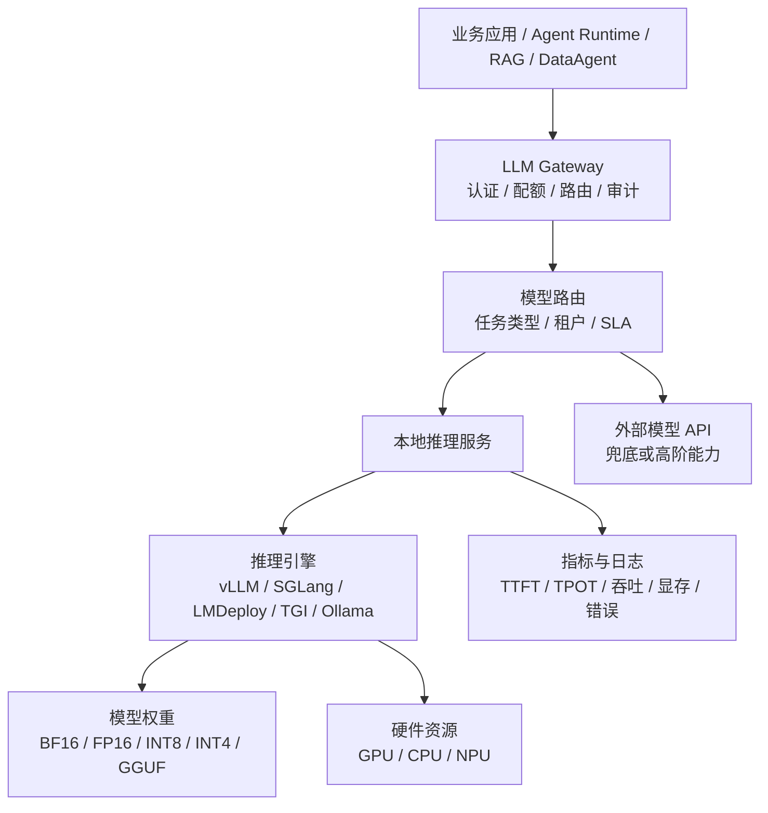
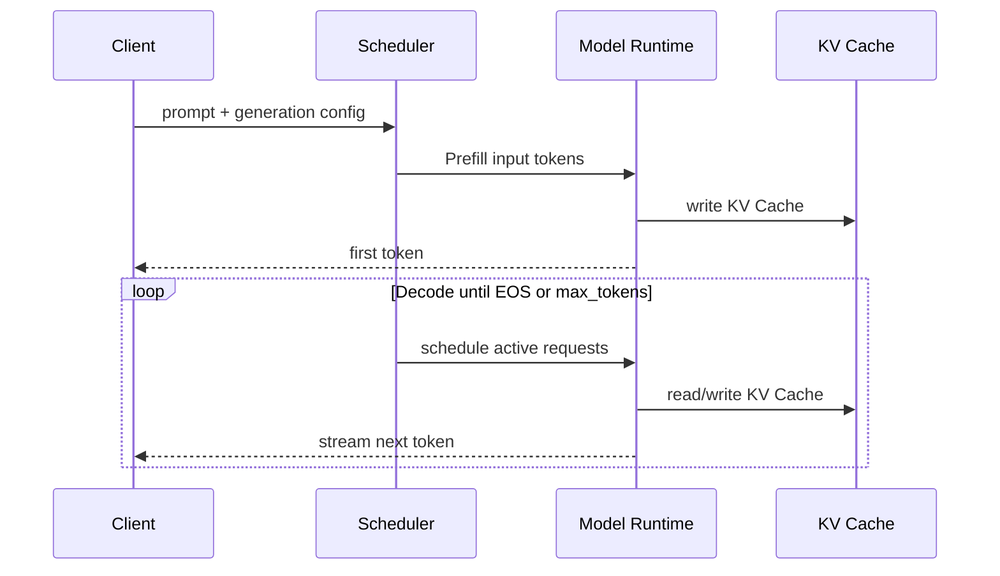

# 第6章 本地推理引擎的吞吐、延迟与部署边界

---

本地推理看起来像“把一个开放权重模型部署到 GPU 上”，进入生产后却会迅速变成容量、延迟和治理问题。客服摘要可能追求吞吐，前台助手关心首 Token，DataAgent 需要长上下文和结构化输出，代码助手又更依赖 Decode 速度。几类负载混在同一个服务池时，任何一种优化都可能伤到另一种任务。

**本地推理的目标不是把模型跑起来，而是把模型变成可被统一网关治理、可测量、可限流、可替换和可回滚的服务能力。** 单机速度只是其中一个指标。

## 6.1 本地推理服务位于哪里

本地推理引擎位于模型权重、GPU 资源和企业平台之间。它负责模型加载、请求调度、连续批处理、KV Cache、流式生成和服务协议，但不应直接承担租户、预算、审批和合规责任。业务应用也不应直接绑定 vLLM、SGLang 或其他引擎的私有参数，而应通过 LLM Gateway 使用稳定契约。




*图6-1：本地推理服务在企业平台中的位置。来源：本书自绘。Alt text：分层图中部是本地推理服务，向上对接模型网关与各业务 Agent，向下占用 GPU 资源池，左右接入模型仓库与监控，标出它作为"模型能力供给层"的位置。*

**业务应用认识的是“能力与 SLO”，平台认识的是“模型服务池”，只有推理层需要认识具体引擎。** 这个边界决定了以后从 Ollama 切到 vLLM、从 vLLM 增加 SGLang，业务代码是否需要跟着重写。

本地推理常见五种部署形态，它们对应不同负载和组织阶段，并非简单成熟度排序。

*表6-1：单机、容器化、集群等推理部署形态的边界、优势与适用场景。来源：本书整理。*

| 形态 | 典型工具 | 优势 | 主要限制 | 适用场景 |
|---|---|---|---|---|
| 单机交互运行 | Ollama | 上手快、试模型方便 | 缺少多租户和调度治理 | 个人验证、Prompt 实验 |
| 单机 HTTP 服务 | Ollama API、LMDeploy | 易接应用、成本低 | 并发与高可用有限 | 小团队工具、边缘节点 |
| GPU 多卡服务 | vLLM、SGLang、LMDeploy、TGI | 连续批处理、并行、吞吐高 | 需要显存规划和监控 | 企业内部门户、客服、RAG |
| 分布式推理集群 | vLLM、SGLang、TGI | 支持大模型和高并发 | 网络、调度与运维复杂 | 平台级模型服务 |
| 边缘轻量推理 | Ollama 等 | 数据不出现场、网络依赖低 | 模型规模和上下文受限 | 门店助手、离线场景 |

上线前还应明确五类服务边界。

*表6-2：模型、资源等各类服务边界必须回答的问题与平台要求。来源：本书整理。*

| 边界 | 必须回答的问题 | 平台侧要求 |
|---|---|---|
| 模型边界 | 哪些模型、版本、量化格式允许上线 | 模型卡、License、评测和发布可追溯 |
| 请求边界 | 最大上下文、输出、工具调用范围 | 网关强制校验 |
| 租户边界 | 谁能调哪个模型、额度多少 | 认证、授权、限流、预算、审计 |
| 性能边界 | TTFT、TPOT、吞吐、并发、超时 | 指标进入 SLO |
| 数据边界 | 输入输出是否含敏感信息 | 脱敏、日志留存和出域策略明确 |

## 6.2 先理解 TTFT、TPOT 与吞吐

大模型推理至少要分开看 TTFT（Time To First Token）和 TPOT（Time Per Output Token）。TTFT 主要受排队、Prefill、输入长度和调度影响；TPOT 更受 Decode、并发批大小、显存带宽和采样策略影响。

对交互式助手，用户常能接受总生成稍长，却很难接受长时间没有首 Token；对离线摘要和批量标注，吞吐和单位成本比 TTFT 更重要。**“tokens/s 更高”并不等于用户体验更好，平台必须按工作负载选择性能工作点。**


*图6-2：吞吐与延迟的取舍曲线。来源：本书自绘。Alt text：横轴为并发吞吐、纵轴为单请求延迟的曲线，随批量增大吞吐上升但延迟也升高，曲线上标出"延迟敏感区"和"吞吐优先区"两段不同的工作点选择。*

常见任务的关注点可以这样划分：

- 在线客服、办公助手：TTFT、流式稳定性、P95/P99；
- RAG 长上下文：Prefill、KV Cache、上下文压缩；
- 批量摘要/评测：吞吐、GPU 小时、单位任务成本；
- 代码生成：TPOT、长输出和格式稳定性；
- DataAgent：结构化输出、正确性、重试成本，而不是单纯 Tokens/s。

多租户平台还必须关注尾延迟。一个超长上下文请求可能持有大量 KV Cache，让其他短请求排队；若短请求又永远优先，长任务可能饥饿。请求长度、最大输出、租户优先级和任务类型因此应进入调度与路由条件。

## 6.3 Prefill、Decode 与缓存：推理优化的共同底座

Transformer 推理大致分为 Prefill 和 Decode。Prefill 一次处理输入并写入 KV Cache；Decode 每一步生成新 Token 并持续读取、追加 KV Cache。



输入越长，Prefill 越重；输出越长，Decode 越重；活跃请求越多，KV Cache 显存压力越大。因此优化要针对瓶颈位置，而不是把所有功能一起打开。

*表6-3：连续批处理、缓存等优化机制的目标、思路与风险。来源：本书整理。*

| 优化机制 | 解决的问题 | 基本思路 | 主要风险 |
|---|---|---|---|
| 连续批处理 | 固定 batch 等齐导致 GPU 空转 | 动态加入新请求、移除已完成请求 | 尾延迟与公平性 |
| KV Cache 管理 | 长上下文和并发占满显存 | 分页、复用、压缩或卸载 | 碎片、复杂度或质量损失 |
| PagedAttention | 预分配和碎片浪费 | 用 block 管理 KV Cache | 依赖引擎和 kernel |
| Prefix Caching | 重复系统提示或长前缀 | 复用相同前缀 KV | 命中率低时收益有限 |
| 张量并行 | 单卡放不下或吞吐不足 | 多 GPU 切分矩阵计算 | 通信开销 |
| 量化 | 权重/KV 占用过高 | FP16/BF16 降到 FP8/INT8/INT4 | 质量退化 |
| 高效注意力内核 | 注意力访存开销大 | 优化 kernel 与显存访问 | 受硬件/驱动影响 |
| 推测解码 | Decode 逐 Token 太慢 | 小模型草拟、大模型验证 | 接受率低会负收益 |
| 结构化输出约束 | JSON/工具参数格式失败 | grammar/schema 限制解码 | 约束过强影响表达 |

连续批处理是在线服务的基础能力，它提高 GPU 利用率，但调度器必须在吞吐和公平性之间取舍。KV Cache 则往往是长上下文并发的真正瓶颈：模型权重还没占满显存，几十个长请求的缓存已经足以触发排队或 OOM。

Prefix Caching 对企业 Agent 特别有价值，因为系统提示、工具 schema、安全规则和业务背景经常稳定复用。要提高命中率，应把稳定内容放在前缀，把时间、trace id、临时过滤条件等动态字段放到后缀。

量化和推测解码需要更谨慎。量化能释放显存和带宽，但必须对 SQL、代码、长上下文和安全拒答单独回归；推测解码更适合代码补全、固定模板摘要等稳定分布，不应默认作用于复杂推理。

*表6-4：不同工作负载的主要瓶颈与应优先采取的优化。来源：本书整理。*

| 工作负载 | 主要瓶颈 | 优先优化 | 不宜优先追求 |
|---|---|---|---|
| 在线客服问答 | 首 Token、短请求并发 | 连续批处理、流式、Prefix Cache | 超长上下文 |
| RAG 长上下文 | Prefill、KV Cache | 检索压缩、分页 KV、前缀复用 | 盲目提高 max_model_len |
| 批量摘要 | 吞吐、成本 | 大 batch、量化、离线队列 | 极低 TTFT |
| 代码补全 | TPOT、格式 | 推测解码、低温、专用模型 | 大而泛的模型 |
| DataAgent / NL2SQL | 结构化输出、正确性 | guided decoding、任务评测、工具校验 | 只看 Tokens/s |

**优化前先明确瓶颈属于排队、Prefill、KV、Decode 还是业务下游；否则“性能优化”很容易优化错层。**

## 6.4 vLLM、SGLang、LMDeploy、TGI 与 Ollama 怎么选

主流引擎的差异不能归结为“谁 benchmark 更快”。企业应先看模型族、硬件、在线/离线负载、结构化输出、API 兼容以及团队是否具备底层调优能力。

*表6-5：vLLM、SGLang、LMDeploy、TGI、Ollama 的定位、优势与适用场景。来源：本书整理。*

| 引擎 | 核心定位 | 典型优势 | 更适合的企业场景 |
|---|---|---|---|
| vLLM | 通用高吞吐 Serving | PagedAttention、连续批处理、OpenAI 兼容、生态活跃 | 通用模型服务、RAG、Agent 平台默认候选 |
| SGLang | 结构化生成和复杂 LLM 程序运行时 | RadixAttention、结构化输出、程序化生成 | Agent、多轮工具调用、JSON 密集任务 |
| LMDeploy | 大模型部署工具链 | TurboMind、量化、中文开源模型生态 | Qwen 等模型快速部署与评测 |
| Hugging Face TGI | HF 生态生产推理服务 | 仓库/Tokenizer/部署链一致 | 深度使用 Hugging Face 的团队 |
| Ollama | 本地模型管理和开发体验 | 拉取和运行简单 | 原型、个人助手、边缘低并发 |

vLLM 通用性强，常作为企业默认候选；SGLang 值得在共享前缀、复杂结构化输出和多轮生成场景单独压测；TGI 的价值是 Hugging Face 生态一致性；LMDeploy 对中文开放模型和量化实践友好；Ollama 更适合作为验证和边缘工具，不应被当作完整企业推理平台。

*表6-6：按决策条件选择推理引擎的首选方向与原因。来源：本书整理。*

| 决策条件 | 首选方向 | 原因 |
|---|---|---|
| 快速把开放模型变成生产 HTTP 服务 | vLLM 或 TGI | API 成熟，生态资料多 |
| 深度依赖 Hugging Face | TGI | 模型、Tokenizer、部署流程一致 |
| 结构化输出与复杂 Agent 程序多 | SGLang / vLLM guided decoding | 更重视约束解码和前缀复用 |
| 边缘、消费级 GPU、离线节点 | Ollama | 部署轻、模型管理简单 |
| 中文模型快速部署和量化评测 | LMDeploy / vLLM | 结合模型族和团队经验 |

**平台不需要押注一个“永远最快”的引擎，而需要让多个 backend 在同一网关契约下可测量、可替换。**

## 6.5 接入统一网关的最低条件

推理服务至少应提供稳定的模型名、消息、生成参数、租户、trace id、超时、流式开关和结构化输出契约。例如：

```json
{
  "model": "qwen3-32b-instruct",
  "messages": [
    {"role": "system", "content": "你是一家多业务线企业内部助手。"},
    {"role": "user", "content": "总结本周客服投诉的三个主要原因。"}
  ],
  "tenant": "retail-customer-service",
  "stream": true,
  "timeout_ms": 30000,
  "generation": {"temperature": 0.2, "max_tokens": 1024},
  "response_format": {
    "type": "json_schema",
    "schema_name": "complaint_summary"
  }
}
```

进入统一网关前，应至少通过以下检查：

- 模型 License、权重来源、量化方式、版本可追溯；
- 业务不直连裸引擎，统一经过 Gateway；
- 压测覆盖短请求、高并发、长上下文、批量和结构化输出；
- 指标至少包含 TTFT、TPOT、tokens/s、队列、显存、KV Cache、错误率；
- 网关限制输入/输出 Token、超时、租户额度和并发；
- 模型/引擎升级具备灰度和回滚；
- 调试日志、审计日志和敏感内容留存有清晰区分。

不同服务池还应登记支持的模型族、上下文、结构化输出、错误语义和已验证任务。网关据此把客服摘要路由到吞吐池，把 DataAgent 路由到结构化输出更稳的池，把敏感租户路由到私有池，而不是只按模型名转发。

## 6.6 发布证据与故障诊断

推理服务上线不能只保留一张压测截图。**可复现的服务版本 + 真实负载边界 + 业务质量回归 + 明确回滚路径，才构成上线证据。**

服务版本应至少记录：

- 模型 Revision / 权重 digest、Tokenizer；
- 推理引擎和镜像版本；
- GPU 类型、数量和显存；
- 量化格式、上下文上限、batch/并行参数；
- 网关路由和灰度范围；
- P95/P99 TTFT、TPOT、错误率和显存峰值；
- 结构化输出、RAG、DataAgent、安全拒答等业务回归样本；
- fallback、回滚目标和观察窗口。

故障诊断应沿真实请求链路拆解，而不是先重启模型。首 Token 慢时依次看网关排队、路由、引擎队列、Prefill、上下文长度和 KV Cache；流式输出中断时检查代理超时、客户端断连、网关重试和引擎错误码；结构化输出失败时区分模型自由生成、guided decoding、schema 版本和工具校验。

降级也必须按风险分层：低风险摘要可转异步队列；普通问答可切小模型或外部兜底；DataAgent、财务、合同和高风险工具调用不能“随便降级到一个能回答的模型”，应进入可解释错误、人工复核或稍后重试。每次降级都应进入 Trace。

容量变更同样按发布处理。新增副本、改量化、调整 KV Cache、batch、上下文或 speculative decoding，都可能同时改变性能和输出质量。变更前后应使用同一批短问答、长上下文、结构化 JSON、工具参数、拒答和高并发任务做回放，避免出现“压测更快、业务更差”。

## 6.7 运行台账、复审与责任边界

本地推理成为共享基础设施后，需要一份轻量但长期可用的运行台账。发布侧记录模型、引擎、硬件、参数、评测与回滚；运行侧记录请求量、延迟分位数、队列、错误类型、结构化输出失败、人工退回和降级。这样 DataAgent 质量下降时，团队才能判断问题来自模型、量化、schema、网关路由还是资源拥塞。

原始 Prompt 和输出不必永久保存。企业应区分：长期保存的结构化元数据、脱敏摘要，以及只在短窗口保留的原始内容。**运行证据的目标是解释事实，不是无限收集文本。**

开源模型还必须明确责任：模型团队负责权重来源、评测和能力边界；平台团队负责服务稳定、资源、路由和回滚；安全合规负责 License、数据来源和风险样本；业务 owner 确认任务适配性。推理框架、CUDA、驱动和算子升级也应进入同一发布门禁。

可以把开放模型分成实验、内部低风险和生产三类。生产模型要求 License、样本、镜像、路由、降级和退役材料齐备。周期复审则检查版本是否仍维护、评测是否覆盖新增任务、SLO/成本是否偏离基线、回滚目标是否仍可启动。服务越接近基础设施，越不能让“当时为什么这么配”只存在于个人记忆中。

## 本章小结

**本地推理不是模型部署动作，而是模型能力供给层。** 应用通过 LLM Gateway 使用稳定契约，平台按租户、任务、SLO、风险和成本把请求分配到合适的服务池。交互任务关注 TTFT，长上下文关注 Prefill 与 KV Cache，批量任务关注吞吐和成本，DataAgent 还要保护结构化输出和工具调用质量。

vLLM、SGLang、LMDeploy、TGI、Ollama 各有适用边界，没有一个引擎能替代平台治理。真正成熟的推理服务，应在业务高峰、容量调整、模型升级和引擎替换时仍能回答：请求去了哪里、为什么排队、何时降级、怎样回滚。

## 参考文献

Kwon, W. et al. (2023). [*Efficient Memory Management for Large Language Model Serving with PagedAttention*](https://arxiv.org/abs/2309.06180). SOSP.

vLLM. (n.d.). [Documentation](https://docs.vllm.ai/).

SGLang. (n.d.). [Documentation](https://docs.sglang.ai/).

Hugging Face. (n.d.). [Text Generation Inference documentation](https://huggingface.co/docs/text-generation-inference/).

NVIDIA. (n.d.). [TensorRT-LLM documentation](https://nvidia.github.io/TensorRT-LLM/).
