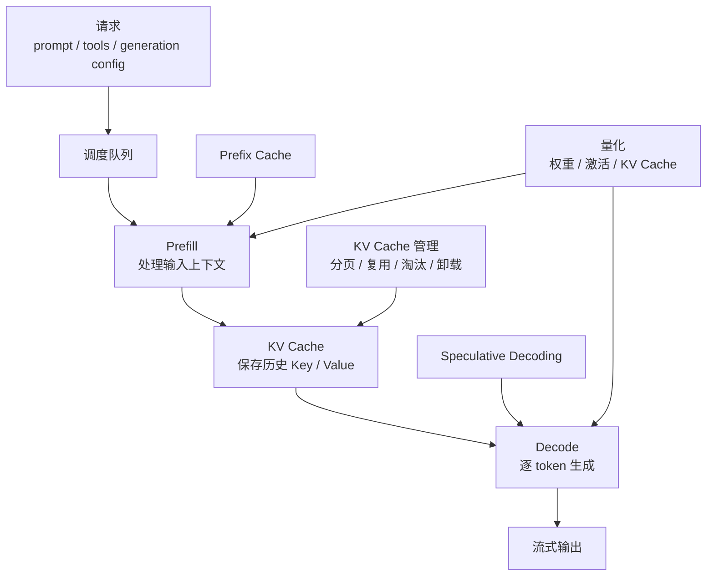
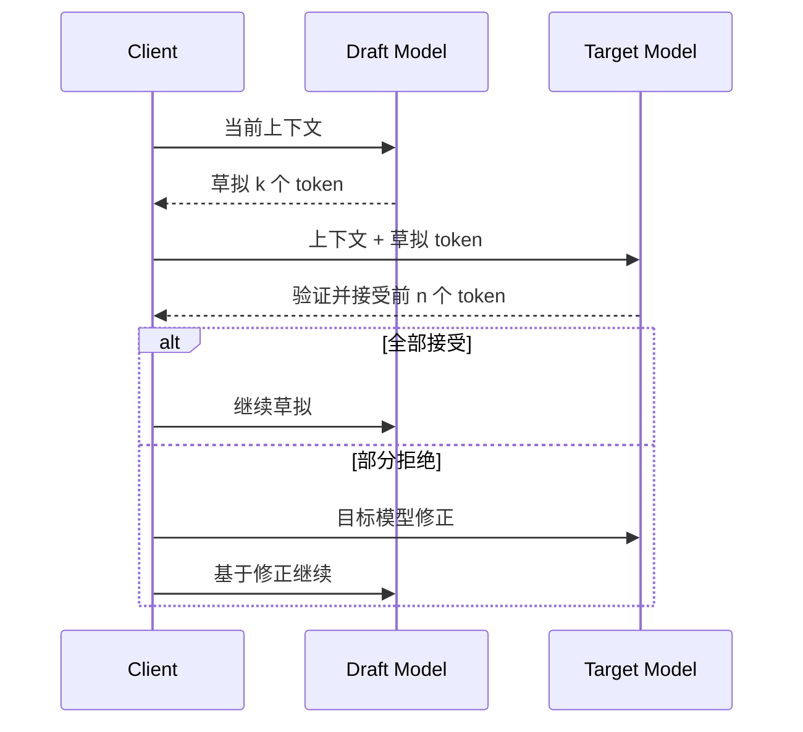

# 第7章 推理优化技术

---

推理优化最容易犯的错误，是先看功能清单，再决定“把哪些开关都打开”。客服摘要、DataAgent、知识助手和代码生成的瓶颈并不相同：有的卡在排队和 Prefill，有的卡在 KV Cache，有的卡在 Decode，还有的真正问题根本不在模型，而在 SQL、检索或工具链。

**推理优化的第一原则是先定位瓶颈，再选择机制；第二原则是性能收益必须和业务质量一起回归。** KV Cache、Prefix Cache、量化和 Speculative Decoding 都可能改善成本或延迟，也可能带来显存压力、尾延迟、结构化输出退化和新的排障复杂度。

## 7.1 先定位瓶颈，再谈优化

一个请求的总耗时至少应拆成网关排队、调度等待、Prefill、首 Token、Decode、工具等待和流式传输。对 DataAgent，还应进一步拆开生成 SQL、执行 SQL、解释结果和报告生成。否则团队只看到“慢”，很容易优化错层。




*图7-1：推理优化机制作用位置。来源：本书自绘。Alt text：一条从请求进入到 Token 输出的推理流水线，标出批处理作用于调度阶段、KV/Prefix Cache 作用于 Prefill、量化作用于权重加载、投机解码作用于 Decode，体现各机制处在流水线的不同环节。*

图 7-1 给出了最重要的对应关系：

- TTFT 高且输入长：先看排队、Prefill、上下文压缩和 Prefix Cache；
- 显存紧张：先看上下文上限、KV Cache、分页和量化；
- Decode 慢：再考虑模型大小、推测解码或采样；
- 结构化输出失败：优先看 schema、guided decoding 和业务校验，而不是盲目追求吞吐。

**一个优化机制只有在明确“改善哪个指标、服务哪类负载、不能伤害哪些质量指标”后，才应该进入灰度。**

## 7.2 KV Cache：长上下文与并发的显存上限

自回归生成时，模型需要保留历史 Token 的 Key/Value，避免每一步都重新计算完整上下文。KV Cache 的规模可以近似理解为：

```text
KV Cache bytes
≈ batch_size
  × sequence_length
  × num_layers
  × 2
  × num_kv_heads
  × head_dim
  × bytes_per_element
```

公式直接说明三件事：上下文越长，单请求缓存越大；活跃请求越多，缓存按序列数叠加；缓存精度越低，单位元素占用越小。


*图7-2：KV Cache 如何随上下文和并发增长。来源：本书自绘。Alt text：三维示意图中 KV Cache 显存占用随上下文长度和并发请求数同时上升，标出显存上限平面，超过即触发排队或拒绝，说明长上下文与高并发共同挤占显存。*

*表7-1：显存与上下文压力的来源、现象、根因与处理方式。来源：本书整理。*

| 压力来源 | 现象 | 根因 | 优先处理方式 |
|---|---|---|---|
| 长上下文 | 单请求显存高、TTFT 长 | Prefill 重、缓存序列长 | 限制上下文、检索压缩、分块、Prefix Cache |
| 高并发 | 显存接近上限、排队 | 每个活跃请求都有 KV | 连续批处理、分页 KV、限流 |
| 长输出 | Decode 越来越重 | 输出 Token 持续追加 KV | 限制 max_tokens、分段生成 |
| 共享系统前缀 | 重复 Prefill | 工具/schema/规则重复计算 | Prefix Cache、Prompt 规范化 |

优化 KV Cache 时，应先减少无效上下文。RAG 把大量低相关文档全部塞入 Prompt，会同时增加 TTFT、显存和幻觉风险；长上下文能力不是放弃检索治理的理由。

PagedAttention 一类分页式 KV 管理，用 block 替代“每个请求按最大长度预留连续显存”，能降低碎片并提高混合长度请求的并发容量。平台无需自己实现内核，但必须理解容量由模型权重和 KV Cache 共同决定。

KV Cache 还涉及公平性与隔离：长上下文租户不能无限占显存，短请求也不能永远抢占队列。上下文上限、最大输出、租户优先级和缓存保留时间应写进路由与调度策略。KV Cache 量化则应作为独立配置做业务回归，尤其保护财务、SQL、代码、引用和安全拒答等高敏感任务。

## 7.3 Prefix Cache：让稳定前缀真正可复用

Prefix Cache 复用已经计算过的共享前缀 KV Cache，因此主要改善 Prefill 和 TTFT，而不是 Decode 速度。企业 Agent 天然有大量稳定前缀：系统角色、工具 schema、安全规则、企业术语、长文档或 DataAgent 表结构。

*表7-2：Prefix Cache 在各类场景的共享前缀、加速收益与风险。来源：本书整理。*

| 场景 | 共享前缀 | 收益 | 风险 |
|---|---|---|---|
| 多轮对话 | 历史、系统提示、角色设定 | 后续轮次减少 Prefill | 历史无限增长占显存 |
| RAG | 同一文档或知识包 | 同文档多问题降低 TTFT | 片段顺序变化降低命中 |
| Agent 工具调用 | 工具 schema、权限和安全规则 | 工具说明可复用 | 动态字段破坏前缀 |
| 批量抽取 | 同一任务说明和 schema | 提高吞吐 | schema 变体过多 |
| DataAgent | 语义层、指标、表结构 | 多问题共享元数据 | 版本变化需要失效缓存 |

Prompt 组织方式决定命中率。较稳的顺序是：

```text
稳定前缀：系统角色 → 安全规则 → 工具 schema → 术语/语义层 → 稳定文档
动态后缀：用户问题 → 临时过滤 → 当前时间 → trace_id → 工具结果
```

如果把时间戳、nonce、用户姓名等动态字段放在开头，即使后面有几千 Token 相同内容，也可能无法复用。

*表7-3：Prefix Cache 相关监控指标的含义与异常解读。来源：本书整理。*

| 指标 | 含义 | 异常说明 |
|---|---|---|
| prefix_cache_hit_rate | 前缀命中比例 | 低命中常说明 Prompt 不稳定 |
| saved_prefill_tokens | 节省的 Prefill Token | 很低说明前缀短、收益有限 |
| cache_eviction_count | 缓存淘汰次数 | 过高说明显存或策略不合理 |
| TTFT before/after | 首 Token 变化 | 命中高但不变，瓶颈可能在排队/Decode |

**Prefix Cache 是性能能力，同时也是隔离能力。** 缓存 key 至少要考虑模型版本、Prompt hash、工具/策略版本和租户或安全域。为了更高命中率跨租户共享敏感前缀，通常不是值得承担的风险。

多轮对话还要避免“越缓存越长”。稳定事实可以摘要为短前缀，可重新读取的大对象保留引用，而不是每轮把全部历史复制进上下文。

## 7.4 Speculative Decoding：只优化 Decode 瓶颈

Speculative Decoding 使用更快的 draft model 先草拟多个 Token，再由目标模型批量验证。正确实现时，它不是用小模型替代大模型，而是尽量减少目标模型逐 Token 前向次数。



收益高度依赖 draft 接受率。固定格式、低温、代码补全等可预测场景通常更适合；复杂推理、多工具分支和高随机任务则可能负收益。

*表7-4：投机解码适合的场景及各自的注意事项。来源：本书整理。*

| 场景 | 为什么适合 | 注意事项 |
|---|---|---|
| 代码补全 | 局部模式强 | draft 最好同族或专门训练 |
| 固定格式摘要 | 输出模板稳定 | schema 频繁变化会降接受率 |
| 客服标准回复 | 句式相对固定 | 仍要验证安全与事实性 |
| 低温采样 | 随机性低 | 高温创作收益不稳定 |

*表7-5：投机解码相关监控指标的含义与目标值。来源：本书整理。*

| 指标 | 含义 | 判断 |
|---|---|---|
| acceptance_rate | draft Token 接受比例 | 低于阈值应关闭 |
| tokens_per_target_forward | 每次目标前向接受多少 Token | 衡量是否有效摊薄目标模型计算 |
| end_to_end_latency | 包含 draft 的完整延迟 | 必须优于基线 P50/P95 |
| quality_regression | 业务质量变化 | 工程实现仍需验证 |

**投机解码更适合成为“特定高流量任务的路由策略”，而不是全局默认开关。** 额外 draft model 会引入显存、模型版本、Tokenizer 和监控成本，这部分复杂度也必须算进收益。

## 7.5 量化：把一个模型版本拆成多个可治理版本

量化通过降低数值精度减少显存、存储和带宽占用。企业最常见的是权重量化和 KV Cache 量化。

*表7-6：权重量化与激活量化的对象、格式、收益与风险。来源：本书整理。*

| 类型 | 作用对象 | 典型格式 | 主要收益 | 主要风险 |
|---|---|---|---|---|
| 权重量化 | 模型参数 | INT8、INT4、GPTQ、AWQ | 降低模型显存 | 推理、代码、数学、长上下文可能退化 |
| 激活量化 | 中间激活 | INT8、FP8 | 降低计算/带宽 | 校准复杂、硬件敏感 |
| KV Cache 量化 | 历史缓存 | FP8、INT8、INT4 | 提高长上下文并发 | 引用与细粒度推理可能退化 |
| 混合精度 | 不同层/张量 | BF16 + INT4/FP8 | 平衡质量和成本 | 配置与测试矩阵变大 |

*表7-7：PTQ 与 QAT 等量化方法的说明、优势与代价。来源：本书整理。*

| 方法类型 | 说明 | 优势 | 代价 |
|---|---|---|---|
| PTQ | 训练后量化 | 部署快 | 依赖校准，极低 bit 可能掉质量 |
| QAT | 训练阶段模拟低精度 | 质量更稳 | 训练成本高 |
| 运行时量化 | 部分张量运行时低精度 | 灵活、易灰度 | 强依赖引擎/硬件/kernel |

通用困惑度或榜单不足以判断企业量化是否可用。至少应覆盖下列业务样本。

*表7-8：量化质量验证各评测集的关注点与典型失败。来源：本书整理。*

| 评测集 | 关注点 | 示例失败 |
|---|---|---|
| 客服问答 | 事实、拒答、安全话术 | 政策日期或条件错误 |
| DataAgent / NL2SQL | 表列、聚合、SQL 合法性 | 漏过滤、造字段 |
| 代码助手 | 语法、依赖、边界 | 可读但不可运行 |
| 合规安全 | 敏感、越权、注入 | 拒答边界漂移 |

稳妥路径通常是先用 BF16/FP16 建基线，再逐步验证 FP8/INT8，随后才对成本敏感任务尝试 INT4；KV Cache 量化要单独测试长上下文。

**生产平台应把 `model-bf16`、`model-int4`、`model-fp8-kv` 视为不同可路由版本，而不是“同一个模型的无差别替代”。** 某个 INT4 版本如果只在 DataAgent 上退化，可以只让该任务回滚到高精度 backend，不必影响客服摘要。

## 7.6 把优化变成任务级路由策略

企业平台不存在“一套最优推理参数”。不同任务应有不同优化组合：

- 模板摘要：可更积极使用量化、Prefix Cache、投机解码；
- 普通知识问答：重点压缩上下文并提升缓存命中；
- DataAgent：优先结构化输出和高精度，不把 Tokens/s 当第一指标；
- 财务/合规：优先引用、拒答与稳定性，性能收益不能越过质量门槛；
- 异步报告：可以牺牲 TTFT 换吞吐和成本。

因此优化参数最好由 Gateway 按任务、风险和 backend 路由，而不是藏在某个服务启动脚本中。网关应把 `model`、`backend`、`tenant_id`、`route_rule_id` 写入 Trace；GPU 调度层提供资源池和队列信息；评测层记录业务质量。三组信息合起来才能解释性能变化。

一次上线评估至少同时看：

- TTFT、TPOT、P95/P99、总耗时和流式中断；
- 吞吐、并发、显存峰值、GPU 小时和缓存命中；
- 结构化解析失败、工具参数错误、拒答、引用和人工退回；
- 重试、降级和 fallback 次数；
- 单任务成本和业务成功率。

**平均延迟下降、GPU 利用率上升或单位 Token 变便宜，都不能单独证明优化成功。** 如果 P99 变差、人工复核上升或高风险输出退化，收益就没有真正进入业务。

## 7.7 发布门禁、回滚与长期复核

推理优化应像模型版本一样发布。每次调整量化、batch、KV Cache、Prefix Cache、draft model、并行方式或上下文长度，都应保留基线版本、任务样本、灰度范围、观察窗口和回滚目标。

轻量发布门禁可以包含：

1. 固定基线：模型、引擎、硬件、路由和主要参数均可复现；
2. 任务分层：客服、RAG、DataAgent、代码、合规分别评估；
3. 失败样本：覆盖结构化缺字段、长上下文引用、拒答、工具参数和流式中断；
4. 护栏指标：明确哪些性能可以交换，哪些质量绝不能退化；
5. 灰度观察：覆盖平峰、高峰、长上下文和至少一次配置/知识变化；
6. 精细回滚：支持按租户、任务和 backend 关闭，而非全局撤销。

运行台账应记录模型/引擎版本、量化格式、KV 精度、Prefix Cache key、draft model、采样参数、GPU 池、路由、评测集和回滚目标。失败实验也值得保留：某 INT4 版本为什么被拒绝、某投机解码为什么接受率太低、某缓存策略为什么限制在单租户，都是未来重新评估的重要证据。

长期复核要看收益是否仍成立。Prompt、RAG 文档、模型版本、业务高峰和用户分布都会变化，曾经高命中的缓存可能逐渐失效，曾经安全的量化也可能在新任务上暴露错误。可以按季度检查：继续默认启用、限制到部分任务、退回候选策略，或补样本后重新评估。

当副作用出现时，应按层隔离：固定模型和 Prompt 比较优化开关，再固定优化配置比较不同路由池与并发，最后沿 Trace 检查缓存命中、batch 等待、draft 接受率、量化版本和重试。**成熟的推理优化不是“更快”，而是团队能够解释更快的代价、适用范围和退出方式。**

## 本章小结

推理优化必须从瓶颈出发。KV Cache 决定长上下文与高并发的显存上限；Prefix Cache 只有在前缀稳定且隔离边界清楚时才能稳定降低 TTFT；Speculative Decoding 更适合可预测的高流量 Decode 任务；量化则应作为独立模型版本治理，并使用企业任务样本验证质量、安全与结构化输出。

**优化的最终交付物不是某个更高的 benchmark，而是一套按任务可路由、可灰度、可观测、可回滚的性能策略。** 第 8 章进入结构化输出后，这些底层变化还会继续影响 JSON、函数参数和工具调用的稳定性。

## 参考文献

Dao, T. et al. (2022). [*FlashAttention: Fast and Memory-Efficient Exact Attention with IO-Awareness*](https://arxiv.org/abs/2205.14135). NeurIPS.

Kwon, W. et al. (2023). [*Efficient Memory Management for Large Language Model Serving with PagedAttention*](https://arxiv.org/abs/2309.06180). SOSP.

Leviathan, Y. et al. (2023). [*Fast Inference from Transformers via Speculative Decoding*](https://arxiv.org/abs/2211.17192). ICML.

Lin, J. et al. (2024). [*AWQ: Activation-aware Weight Quantization for LLM Compression and Acceleration*](https://arxiv.org/abs/2306.00978). MLSys.
