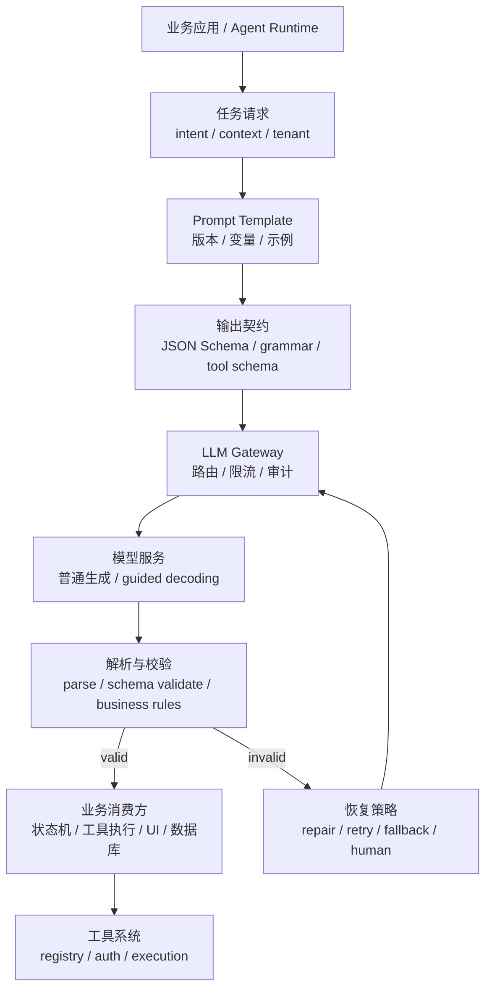
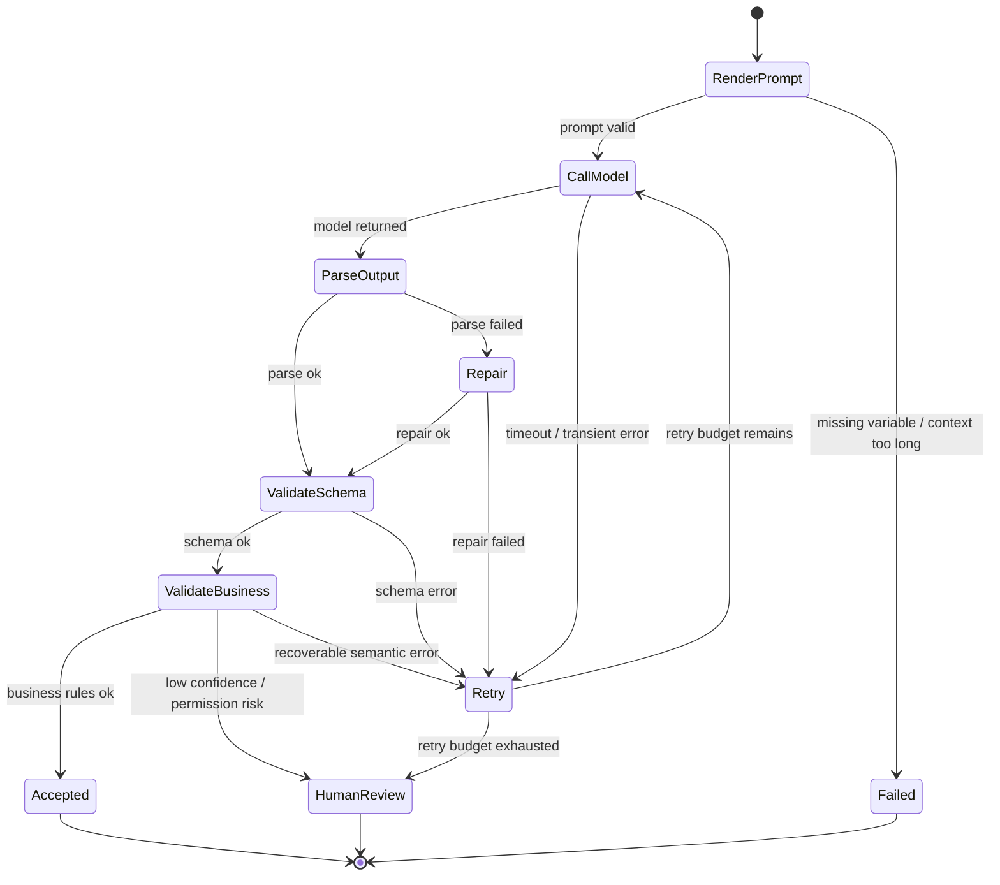

# 第8章 结构化输出与提示工程

---

企业模型输出很少只停在聊天框里。工单分类要写 CRM，合同抽取要进入提醒系统，DataAgent 要生成工具参数，Generative UI 要返回组件树。此时“回答看起来合理”远远不够：字段、枚举、证据、权限、幂等和失败恢复都会变成系统责任。

**Prompt 是输入侧契约，结构化输出是输出侧契约，工具调用是执行侧契约；三者只有和版本、校验、权限、评测与回滚一起管理，才能成为生产接口。** “请输出 JSON”只是提示，不是契约。

## 8.1 从可读文本到四层契约

结构化输出的价值不是让文本更整齐，而是把模型结果变成可以验证、可以拒绝、可以恢复的接口对象。语法合法只是最低要求：一个完全合法的 JSON 仍可能包含错误证据、非法业务含义或越权工具参数。

*表8-1：常见结构化任务的输出对象与失败后果。来源：本书整理。*

| 任务 | 输出对象 | 下游消费方 | 主要风险 |
|---|---|---|---|
| 工单分类 | 类别、置信度、证据、人工复核标记 | CRM、工单系统 | 误分派、自动化越权 |
| 合同抽取 | 日期、金额、义务、风险条款、证据位置 | 合同库、提醒系统 | 脏数据入库、遗漏风险 |
| DataAgent 规划 | 工具名、参数、停止条件、澄清问题 | Runtime、SQL、权限系统 | 调错工具、越权查询 |
| 生成式 UI | 表单 schema、组件树、数据绑定 | 前端渲染层 | 页面不可渲染、交互错位 |


*图8-1：结构化任务的四层契约。来源：本书自绘。Alt text：图中从上到下展示 Prompt 输入契约、模型生成、schema 输出契约和下游消费四层，每层都有校验点，输出通过 schema 后才能进入业务系统。*

一个结构化任务至少要明确四层契约。

*表8-2：结构化任务的四层契约。来源：本书整理。*

| 层次 | 关键问题 | 典型资产 |
|---|---|---|
| 语义契约 | 模型要完成什么业务动作 | 任务说明、边界规则、示例 |
| 结构契约 | 输出必须长什么样 | JSON Schema、枚举、字段说明 |
| 执行契约 | 是否允许调用工具、如何执行 | tool schema、权限策略、幂等键 |
| 治理契约 | 怎样发布、评测、灰度和回滚 | Prompt/schema 版本、评测、Trace |

**结构化任务发布的最小单位不是 Prompt，而是 Prompt + schema + 工具契约 + 模型/生成参数 + 评测样本 + 回滚策略。** 任一部分单独变化，都可能让链路失配。

企业 Prompt 也应接口化，而不是当成一段随手修改的文本。例如投诉分类任务：

```text
你是客服质检助手，只做投诉原因归类，不生成赔付承诺。

任务：
从工单文本中识别主投诉原因，并给出最多三个来自原文的证据句。

业务规则：
- category 只能从 delivery_delay、quality_issue、refund_dispute、service_attitude、unknown 中选择。
- 信息不足时选择 unknown，并填写 missing_info。
- 如果投诉涉及退款和物流，优先选择导致升级的原因。

输出：
返回符合 complaint_classification_v2 的 JSON。不要输出 Markdown。
```

这段 Prompt 的价值在于规则可测试：枚举能进入 schema，证据可以回指，`unknown` 提供合法失败出口，“不生成赔付承诺”可以进入安全样本。Few-shot 和推理技巧可以补充能力，但不能替代接口契约。

## 8.2 解析、schema、业务校验与恢复闭环

生产链路必须假设模型会返回“差一点正确”的结果：Markdown 代码块、缺字段、非法枚举、证据不存在、参数不完整、工具越权。**invalid 分支不是异常补丁，而是结构化输出的核心设计。**




*图8-2：结构化输出的校验与恢复闭环。来源：本书自绘。Alt text：图中展示模型生成、解析、schema 校验、业务校验和下游消费的循环；校验失败会进入修复、重试、降级或人工复核分支。*

请求对象应保存 Prompt、模型、schema 和恢复策略，而不是只传一段文本：

```json
{
  "task": "complaint_classification",
  "tenant": "demo-retail",
  "prompt": {
    "template_id": "complaint_classifier",
    "version": "2.1.0"
  },
  "model": {
    "name": "qwen3-32b-instruct",
    "temperature": 0.1
  },
  "response_format": {
    "type": "json_schema",
    "schema_id": "complaint_classification",
    "schema_version": "2.0.0"
  },
  "recovery": {
    "max_retries": 2,
    "repair": true,
    "fallback": "human_review"
  }
}
```

schema 应小而明确。例如：

```json
{
  "type": "object",
  "required": ["category", "confidence", "evidence", "requires_human_review"],
  "additionalProperties": false,
  "properties": {
    "category": {
      "type": "string",
      "enum": ["delivery_delay", "quality_issue", "refund_dispute", "service_attitude", "unknown"]
    },
    "confidence": {"type": "number", "minimum": 0, "maximum": 1},
    "evidence": {"type": "array", "items": {"type": "string"}, "minItems": 1, "maxItems": 3},
    "requires_human_review": {"type": "boolean"},
    "missing_info": {"type": "string"}
  }
}
```

`additionalProperties: false` 防止下游误读未定义字段；`unknown` 则避免模型在信息不足时被迫猜一个错误类别。

结构化链路的状态机应明确哪类错误可以修复、哪类需要人工、哪类必须拒绝：



*表8-3：结构化请求的失败类型与恢复策略。来源：本书整理。*

| 失败类型 | 典型触发条件 | 处理方式 |
|---|---|---|
| Prompt 渲染失败 | 缺变量、过长、未脱敏 | 阻断并补变量/裁剪 |
| 解析失败 | 代码块、尾随文本、半截 JSON | repair 一次，仍失败则有限重试 |
| schema 失败 | 缺字段、类型错、非法枚举 | 返回校验错误重试，超预算转人工 |
| 业务校验失败 | 证据不存在、单位缺失、低置信度 | 补检索、澄清或人工复核 |
| 工具校验失败 | 工具不存在、参数越权、动作需确认 | 拒绝执行并审计 |
| 执行不确定 | 超时、网络中断、非幂等动作状态未知 | 查幂等状态，禁止盲目重试 |

**重试不是通用恢复手段。证据不足不能靠重复生成解决，权限拒绝更不能“重试到成功”。**

## 8.3 四组关键工程决策

### Prompt 约束、约束解码与后置校验

Prompt 兼容性最好，但格式可靠性最低；后置校验容易接入，但会消耗一次失败调用；约束解码能减少非法结构，却不能判断业务语义。生产常用三层组合：Prompt 讲清语义 → guided decoding 保证形状 → schema + 业务校验决定能否使用。

**约束解码解决“长得对不对”，业务校验解决“能不能用”。**

### 大 schema 一次生成还是小 schema 多步生成

简单表单可一次生成。合同、DataAgent 等复杂任务更适合拆成多个小对象：先分类或规划，再按结果抽取字段或生成工具参数。多步会增加调用次数，但错误定位和局部重试更清楚，高风险任务通常值得付出这部分成本。

### 是否输出完整推理过程

企业系统不应默认把完整思维草稿展示或长期记录。更稳妥的是保存结论、证据引用、必要解释、原始输入和人工复核。需要可解释性时，优先要求可验证证据，而不是不可验证的长篇推理文本。

### 模型选工具还是工作流裁剪工具

低风险开放式助手可以让模型在有限工具集中自主选择；退款、审批、数据库查询和外发消息等高风险流程，应先由工作流和 Policy 根据状态、权限裁剪工具，再让模型填参数。工具越多，不仅误调用概率越高，也会增加 Prompt 和缓存压力。

## 8.4 运行时落点：把模型输出挡在业务动作之前

当前 mini-platform 已有 `core/gateway/` 和 `core/registry/tool_registry.py`，可以在此基础上增加三类能力。

*表8-4：结构化输出相关能力的建议路径。来源：本书整理。*

| 能力 | 建议路径 | 说明 |
|---|---|---|
| Prompt 模板 | `mini-platform/core/gateway/prompt_template.py` | 管理变量、版本和渲染 |
| 结构化解析 | `mini-platform/core/gateway/structured_output.py` | parse、schema validate、repair |
| 工具调用校验 | `mini-platform/core/registry/tool_registry.py` | 参数校验、权限和执行策略 |

轻量实现可以先支持 JSON 对象解析和必填字段校验，生产再替换为 Pydantic、jsonschema、Instructor、Outlines 或推理引擎 guided decoding。

```python
from dataclasses import dataclass
import json
from typing import Any

@dataclass(frozen=True)
class StructuredResult:
    ok: bool
    data: dict[str, Any] | None
    errors: list[str]
    raw: str


def parse_structured_json(raw: str, required: set[str]) -> StructuredResult:
    try:
        data = json.loads(raw)
    except json.JSONDecodeError as exc:
        return StructuredResult(False, None, [exc.msg], raw)

    if not isinstance(data, dict):
        return StructuredResult(False, None, ["expected object"], raw)

    errors = [f"missing: {f}" for f in sorted(required) if f not in data]
    return StructuredResult(not errors, data if not errors else None, errors, raw)
```

模型最多提出工具名和参数，真正执行必须经过 Registry、Policy 和幂等控制。创建工单、发送邮件、退款、写审批记录等非幂等动作必须携带 `idempotency_key`。**“模型生成了合法参数”不等于“平台允许执行”。**

发布前至少检查以下内容：

*表8-5：结构化输出发布准入。来源：本书整理。*

| 验收项 | 检查问题 | 证据 |
|---|---|---|
| 契约完整性 | Prompt、schema、工具和模型版本是否绑定 | 发布记录、版本、回滚目标 |
| 失败恢复 | 解析/schema/工具失败是否有路径 | 重试、人工队列、降级策略 |
| 安全边界 | 高风险工具是否鉴权和确认 | 权限测试、审计日志 |
| 成本性能 | 重试和多采样是否有预算 | token、P95、失败成本 |
| 回归评测 | 成功、边界、拒答、恶意输入是否覆盖 | 评测报告、失败样本 |

## 8.5 Schema 演进：把它当 API，而不是 Prompt 附件

结构化输出一旦有消费者，schema 就进入 API 生命周期。新增字段通常容易兼容；删除字段、修改枚举、改变字段语义、收紧必填项都需要迁移窗口。模型已经按新 schema 输出，而前端、工具 handler、报告模板、Trace 解析器仍按旧格式消费，是非常常见的线上故障。

**每个结构化结果至少应携带 `schema_version`；高风险链路还应明确 producer、consumer 和迁移说明。**

迁移窗口要考虑三种兼容：

- 读兼容：新消费者能解释旧对象和历史 Trace；
- 写兼容：灰度期按租户/任务输出旧版或新版；
- 回放兼容：同一评测样本能比较新旧 schema 的业务结果。

高风险动作迁移时，还应检查幂等键、权限字段、证据字段和失败状态。新字段缺失时不要静默补成“看起来合理”的业务事实。风险等级缺失默认成低风险、审批意见缺失默认通过、日期缺失默认本月，都会把技术默认值变成真实业务判断。若必须补默认，应保留来源标记，区分模型生成、规则补齐、用户确认和人工复核。

Schema 回滚也比 Prompt 回滚复杂。新版本上线后，下游可能已经写入新字段。较稳妥的方式是在短期保留新旧映射和版本化解析，必要时把新请求路由回旧 schema，同时仍能解释已经产生的新版本 Artifact。

固定回放集至少覆盖：正常输入、缺字段、非法枚举、证据不足、权限拒绝和工具超时。每次 Prompt、schema、模型、解析器或工具契约变化都重新运行，并比较格式、业务校验、消费者行为和审计记录。

## 8.6 观测、发布证据与恢复

结构化输出的核心指标不应只有“JSON 合法率”。至少要分开观察：

- parse 失败率；
- schema 失败率与字段缺失率；
- 业务校验失败率；
- 自动 repair / 重试成功率；
- 人工介入率；
- 工具拒绝率与幂等冲突；
- 不同 Prompt/schema/model/tool 版本组合的失败分布。

**只有把失败按层分类，团队才知道该修 Prompt、schema、业务规则、权限还是工具，而不是所有问题都归结为“模型不听话”。**

Trace 至少应保留 template_id、schema_id、model、generation_config、parse/validation error、retry_count、tool_call、tool_result、latency、token usage 和最终状态。原始输出与“校验后真正被业务消费的对象”应区分保存；敏感文本按数据策略脱敏或缩短留存窗口。

三个典型失败可以说明恢复边界：

- JSON 被 Markdown 包裹：可 repair 一次，高频任务启用 schema/grammar 约束；
- 字段合法但证据不存在：应回到证据校验或人工，而不是继续修 JSON；
- 工具超时后重复创建工单：必须使用业务幂等键查询执行状态，禁止盲目重放。

接口契约的 owner 也应明确。业务定义字段语义，平台维护解析与恢复，安全团队定义高风险动作，前端把“格式失败、证据不足、权限拒绝、人工审核”等状态翻译成用户可理解的交互。字段语义没有共同定义时，合法 JSON 反而更容易把错误悄悄传给下游。

早期平台不需要覆盖所有任务。先跑稳三类链路：信息抽取、工具调用和人工复核。它们分别覆盖读、写和高风险恢复，足以暴露大多数结构化输出问题。

## 本章小结

**结构化输出的成熟度不取决于 Prompt 写得多复杂，而取决于输出能否被解析、校验、拒绝、恢复、复现和回滚。** Prompt 负责输入语义，schema 负责输出形状，业务规则判断字段能否使用，Registry 与 Policy 决定动作能否执行。

复杂任务应优先使用小 schema、多步验证和局部重试；高风险工具必须鉴权、幂等和审计；schema 演进要像 API 一样提供版本、迁移窗口和消费者保护。只有这些责任由平台承担，模型输出才真正从“像 JSON 的文本”变成可被企业系统消费的接口。

## 参考文献

JSON Schema. (n.d.). [Specification](https://json-schema.org/).

OpenAI. (n.d.). [Structured Outputs guide](https://platform.openai.com/docs/guides/structured-outputs).

Guidance. (n.d.). [Documentation](https://guidance.readthedocs.io/).

Instructor. (n.d.). [Documentation](https://python.useinstructor.com/).
