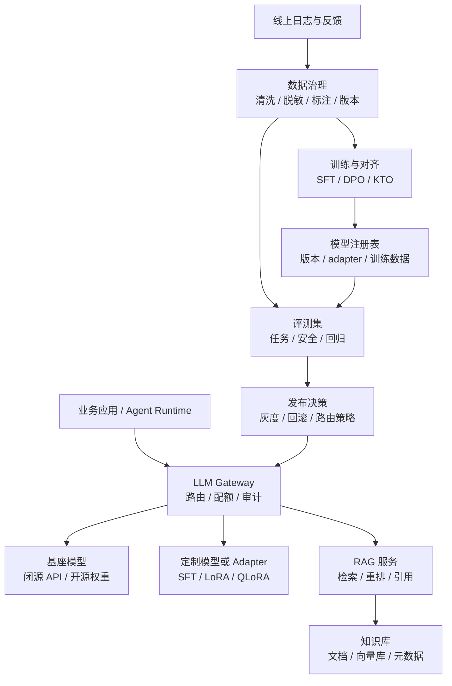
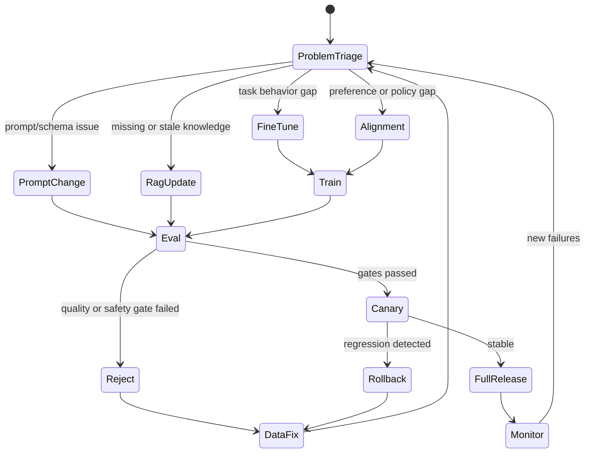

# 第9章 模型能力定制与知识增强

---

企业常把“模型不懂业务”归结为需要微调，但同一句抱怨背后可能是四种完全不同的问题：知识过期、输出契约不稳、任务模式与基座模型差异大，或偏好与安全边界不符合组织要求。技术路线选错，团队可能花很大成本训练出一个仍然不能上线的模型。

**能力定制的第一步不是训练，而是失败样本分诊：先判断缺知识、缺格式、缺任务能力还是缺偏好边界，再选择 Prompt、RAG、微调或对齐。** 动态事实应外部化，稳定任务模式才值得写进模型参数。

## 9.1 先分诊问题，再选择技术路线

企业常用三类能力定制手段：微调、RAG 和对齐；Prompt/结构化输出则是更低成本、通常也更先尝试的接口修复手段。

*表9-1：能力定制路线与适用问题。来源：本书整理。*

| 路线 | 改变什么 | 适合解决 | 更新频率 |
|---|---|---|---|
| 微调 | 模型参数或 adapter | 任务习惯、领域语言、稳定输出模式 | 周级到月级 |
| RAG | 外部上下文 | 最新政策、手册、合同、指标口径 | 小时级到天级 |
| 对齐 | 偏好与拒答倾向 | 风格、安全边界、风险分级 | 周级到季度 |

一个客服助手完全可能同时使用三者：RAG 提供最新政策，LoRA 学习分类口径，对齐控制赔付承诺和拒答边界。但每个问题都要先证明根因。

*表9-2：常见失败症状、可能根因与优先方案。来源：本书整理。*

| 症状 | 可能根因 | 优先方案 |
|---|---|---|
| 不知道最新政策、价格、库存、合同状态 | 知识缺失或过期 | RAG、工具查询、知识快照 |
| 信息基本正确但接口格式不稳 | Prompt/schema 不稳定 | Prompt、结构化输出、回归样本 |
| 特定术语、SQL、代码模式长期错误 | 任务分布与基座差异大 | SFT、LoRA、QLoRA |
| 语气、拒答、风险等级不符合规范 | 偏好和安全边界未对齐 | 偏好数据、DPO/KTO、护栏 |
| 错误偶发、样本很少 | 证据不足 | 先补评测集和日志标注 |

**先做可解释、可回滚、局部影响的改动。** Prompt/schema 和 RAG 快照容易灰度与撤回；微调会改变模型行为，应在企业评测证明必要后再进入训练。


*图9-1：能力定制技术路线选择。来源：本书自绘。Alt text：图中以问题分诊为起点，分别指向知识过期、格式不稳、能力不足和偏好边界四类问题，并对应 RAG、Prompt、微调和对齐路线。*

几个边界尤其重要：

- 员工制度、库存、价格、合同状态、指标口径等动态事实，不应靠微调永久写入模型；
- RAG 能提供知识，但不能自动教会模型稳定生成复杂 SQL 或执行任务模式；
- 对齐能改变拒答和风格，但不能替代权限、脱敏、工具白名单和审计；
- 训练数据不是越多越好，过期政策、错误话术、临时 workaround 和 SQL 反模式都可能被模型学进去。

分诊样本应保留原始输入、上下文、检索结果、工具结果、模型输出、人工判断和最终业务后果。先问“模型是否拥有完成任务的信息”，再问“动作空间是否正确”，最后问“输出是否符合接口和业务规则”。

## 9.2 能力定制是一条持续发布闭环

能力定制不是一次训练任务，而是一条从线上失败回到数据、知识、训练、评测和发布的反馈回路。




*图9-2：模型能力定制的持续闭环。来源：本书自绘。Alt text：图中展示线上失败样本进入数据治理、训练或知识更新、评测、灰度发布和监控的闭环，模型版本、adapter 和知识快照都进入注册表。*

这条链路有三个关键边界：业务应用只声明任务、租户、风险和知识域，不关心底层是否 LoRA 或 RAG；训练集与评测集必须隔离；模型、adapter、Prompt 和知识快照都要版本化，否则线上回答无法复现。

*表9-3：能力定制闭环的核心组件。来源：本书整理。*

| 组件 | 职责 | 主要风险 |
|---|---|---|
| Sample Collector | 收集失败、反馈、人工改写和专家样例 | 偏差采样、敏感数据混入 |
| Data Curator | 脱敏、去重、标注、分层、版本化 | 标签冲突、污染评测集 |
| Knowledge Pipeline | 解析、切分、索引、元数据过滤 | 过期文档、权限错配 |
| Trainer | SFT、LoRA、QLoRA、DPO、KTO | 过拟合、遗忘、过度拒答 |
| Eval Harness | 任务、事实、安全、成本和延迟评测 | 指标单一、测试污染 |
| Registry & Release | 管理版本、灰度和回滚 | 版本不可追踪、无法回退 |

训练任务至少要把基座、数据、方法和门禁写清楚：

```yaml
job_id: customer_service_sft_2026_06
base_model: qwen3-32b-instruct
method: lora_sft
dataset:
  train: datasets/customer_service/sft/train-2026-06.jsonl
  validation: datasets/customer_service/sft/validation-2026-06.jsonl
  data_policy: pii_redacted_v2
training:
  lora_rank: 16
  learning_rate: 0.0001
  epochs: 2
evaluation:
  suites: [customer_service_classification, refusal_and_compliance, structured_output_regression]
  gates:
    task_accuracy_min: 0.88
    json_validity_min: 0.98
    safety_regression_max: 0.01
release:
  canary_tenants: [demo-retail]
  rollback_to: qwen3-32b-instruct@baseline
```

RAG 的契约重点不同，应记录知识快照、切分、索引、重排、引用和权限过滤：

```yaml
knowledge_domain: employee_policy
snapshot: 2026-06-01
sources: [hr_policy_handbook, benefits_faq]
index:
  embedding_model: bge-m3
  chunk_policy: policy_v3
retrieval:
  top_k: 20
  rerank_top_k: 6
  require_citation: true
security:
  metadata_filters:
    tenant: demo-company
    visibility: employee
```

**模型训练资产和知识资产必须分别版本化：前者解决行为模式，后者解决可更新事实。**

## 9.3 Prompt、RAG、微调与对齐如何取舍

### Prompt：先修规则和接口

Prompt 调整成本低、上线快、易回滚，适合任务规则、输出格式、少量边界样例。若问题本质是字段、枚举、拒答状态或工具参数不稳，应先回到第 8 章的结构化契约，而不是训练模型“更听话”。

### RAG：把动态、敏感、需引用的事实留在外部

知识更新频繁、需要引用来源、需要按租户/权限过滤时，RAG 或工具查询通常是默认选择。**事实越动态、越敏感、越需要删除和审计，就越不应该写进模型参数。**

RAG 也有自己的生产责任：文档版本、重复/冲突、metadata、权限、召回和引用都需要评测。知识库不是“文件上传成功”就完成建设。

### SFT / LoRA / QLoRA：学习稳定任务模式

当模型长期在领域术语、分类、抽取、SQL 模式或固定工作流上表现不稳，而且 Prompt、RAG 和评测已经较稳定时，微调才更可能带来持续收益。

全量微调能力强，但成本、回滚和多租户治理复杂；LoRA / QLoRA 更适合多数企业场景，因为 adapter 小、发布快、可按租户/任务路由，也容易局部回滚。它们的上限仍受基座模型约束。

### 偏好对齐：改变“应该怎么答”，不是赋予系统权限

DPO、KTO 等方法适合安全拒答、风险分级、客服风格和组织偏好，但必须单独检查过度拒答和正常可答样本。偏好对齐不能替代硬权限、Policy、工具白名单和审计。

### 通用模型、adapter 与领域模型矩阵

早期平台宜保持单一通用模型；任务增加后，用通用基座 + adapter 往往是较好的折中；只有高价值领域且评测/运维成熟后，才值得维护多个领域模型。模型矩阵越复杂，越依赖统一注册、路由、评测和成本治理。

## 9.4 数据、评测与生命周期门禁

能力定制的发布链应该从分诊进入不同路线，再统一回到 Eval 与灰度。



*表9-4：能力定制链路的失败模式与修复路径。来源：本书整理。*

| 失败模式 | 触发条件 | 修复路径 |
|---|---|---|
| 选错路线 | 微调解决知识过期，RAG 解决格式 | 重新分诊根因 |
| 数据泄露 | 日志/样本含敏感信息 | 脱敏、授权、留存策略 |
| 评测污染 | 训练含评测样本或近似改写 | 指纹、去重、隔离 |
| 过拟合 | 训练提升、线上下降 | 降 epoch、扩验证与多样性 |
| 灾难性遗忘 | 领域提升、通用/安全下降 | 混合回归、任务级 adapter 路由 |
| 过度拒答 | 正常问题也大量拒绝 | 增加安全可答正例、分风险级别 |
| RAG 噪声/越权 | 召回低相关或无权限文档 | 重排、metadata 过滤、检索评测 |
| 不可回滚 | 模型/adapter/Prompt/索引未绑定 | Registry 完整版本化 |

**训练数据、评测数据和知识数据都必须知道来源、时间、适用范围、脱敏状态和 owner。** 一个地区的临时业务特例不能被无意中训练成全局规则，旧政策也不能混入长期样本。

发布时不要只看平均分。一个 adapter 可能总体准确率提高，却让 JSON 合法率、安全拒答或长尾类别下降；RAG 引用命中率提高，也可能出现权限过滤回退。主指标、护栏指标和失败样本必须同时进入报告。

## 9.5 在平台中的运行时组合

mini-platform 中，能力定制不需要让业务代码认识各种技术细节。可以由 `core/gateway/` 统一决定某类任务应使用哪个基座、adapter、Prompt、RAG 域和安全策略；`core/eval/` 提供准入证据；`core/rag/` 与 `infra/vectorstore/` 管理知识；`core/observability/` 保存线上事实。

```python
from dataclasses import dataclass

@dataclass(frozen=True)
class ModelRoute:
    base_model: str
    adapter: str | None = None
    prompt_template: str | None = None
    rag_domain: str | None = None
    require_citation: bool = False
    safety_profile: str = "default"

@dataclass(frozen=True)
class TaskContext:
    task: str
    risk_level: str


def resolve(ctx: TaskContext) -> ModelRoute:
    if ctx.task == "employee_policy_qa":
        return ModelRoute(
            base_model="qwen3-32b-instruct",
            prompt_template="policy_qa_v3",
            rag_domain="employee_policy",
            require_citation=True,
            safety_profile="hr_policy",
        )
    if ctx.task == "customer_service_classification":
        return ModelRoute(
            base_model="qwen3-32b-instruct",
            adapter="customer_service_lora_v2",
            prompt_template="complaint_classifier_v2",
        )
    return ModelRoute(base_model="qwen3-32b-instruct", prompt_template="default_v1")
```

一次线上请求的 Trace 至少应能还原：`base_model + adapter + prompt_template + schema + rag_snapshot + safety_profile + release_id`。否则“同一个模型名”背后已经使用了不同能力组合，事故很难复现。

*表9-5：模型能力定制上线前验证项。来源：本书整理。*

| 验收项 | 检查问题 | 证据 |
|---|---|---|
| 路线选择 | 是否明确属于 Prompt、RAG、微调或对齐 | 分诊记录、失败样本 |
| 数据治理 | 样本是否脱敏、去重、分层并隔离评测 | 数据版本、脱敏、指纹报告 |
| 评测结果 | 任务、安全、结构化和通用能力是否过门禁 | eval report、失败清单 |
| 发布控制 | 模型、adapter、Prompt、知识快照能否灰度回滚 | Registry、路由策略 |
| 线上监控 | 拒答、幻觉、引用、成本、延迟是否可观察 | dashboard、trace、反馈 |

## 9.6 把定制能力作为资产，而不是特殊分支

能力定制进入生产后，平台会同时出现基础模型、租户 adapter、任务 Prompt、知识快照和安全策略。若这些资产没有统一台账，线上行为会越来越难解释。

资产记录至少应包含：

- base model / adapter / Prompt / RAG snapshot；
- 训练或知识数据版本；
- 评测集、目标指标和失败样本；
- 适用租户、任务和风险等级；
- owner、灰度范围、成本和回滚目标；
- 复审周期与退役条件。

**定制能力必须有明确的生效范围。一个业务线的特殊 adapter 或 Prompt 不应因为“效果不错”自动扩散到所有租户。** 路由命中原因应进入 Trace。

定制路线还要计算维护成本。RAG 的成本在文档治理、解析、索引和检索评测；微调在样本、训练、部署和回归；偏好对齐在偏好数据、人工标注和安全评测。业务提出“让模型更懂我们”时，平台需要比较未来数月的维护责任，而不只是当前哪个方案最先进。

衡量定制价值也要回到业务结果：分类准确率提高是否减少人工分派，制度问答引用改善是否减少升级，SQL 质量提高是否缩短分析周期。离线分数没有转成业务结果时，不应无限扩大定制资产。

## 9.7 复审、退役与知识回收

定制资产会过期。基础模型升级、政策和产品变化、业务 owner 离开、评测集失效，都可能让曾经有效的 adapter、Prompt 或知识快照变成负担。可以按月或季度复审：使用量、失败样本、业务收益、维护成本、评测结果、安全风险和替代能力。

退役可以分级：先冻结新流量，再补样本或更新知识；仍无法证明收益时，路由退回基础模型或通用策略。历史记录不应删除，因为历史 Trace 仍需要解释为什么当时使用过该定制版本。

**定制能力退役时，应回收知识，而不是把试点经验一起丢掉。** 有价值的失败样本进入 Eval，稳定术语进入 Glossary，高质量事实进入知识库，风险样本进入 Guardrails，工具模式进入通用契约。这样局部定制可以逐渐沉淀成平台公共能力。

客户或业务线如果依赖专属版本，还需要版本冻结与变更窗口。冻结的是一组明确组合：模型、Prompt、工具、知识、策略和评测样本，而不是永不升级。新版本应先在客户样本上回放，涉及正式承诺时提供灰度、对比与回滚。

同时应避免长期 fork。能用配置解决的不复制 Prompt，能沉淀为通用模板的不保留专属版本，只有真正涉及专有流程、权限或术语的部分才独立维护。否则平台会被大量特殊分支拖入不可维护状态。

## 9.8 发布证据：证明“更好”，也证明“没有伤到别处”

能力定制不能凭几个成功 Demo 上线。发布证据至少覆盖四类样本：目标失败样本、相邻样本、反向/高风险样本、历史高频回归样本。对于 RAG + 微调组合，还要尽量区分改善来自模型参数、知识内容还是 Prompt。

典型问题的责任层应明确：

- 政策更新后继续答旧制度：优先修 RAG 快照和版本，不重新训练记忆；
- 客服微调后 JSON 有效率下降：结构化任务单独评测，把 JSON validity 设为 gate；
- DPO 后过度拒答：补充安全可答正例并拆分风险等级；
- RAG 召回无权限文档：索引写入租户、部门、密级、有效期并强制过滤；
- 新 adapter 无法复现：Trace 补全模型、adapter、Prompt、schema、RAG snapshot 和 release_id。

**定制发布要同时证明目标收益和原有能力没有不可接受退化。** 如果收益只覆盖少量低价值样本，却增加长期路由、训练和评测成本，应优先考虑更简单的 Prompt、RAG 或工具方案。

## 本章小结

微调、RAG 和对齐解决不同问题：**微调学稳定任务模式，RAG 接可更新事实，对齐调偏好；Prompt 和结构化契约则通常是更先尝试的低成本接口修复。** 动态、敏感、需要引用和可删除的事实应优先外部化，不能为了“更懂业务”全部写进模型参数。

LoRA / QLoRA 适合企业多租户和多任务定制，但仍必须与数据治理、评测、灰度、路由、Trace 和退役绑定。能力定制真正成熟的标志，不是模型版本越来越多，而是每个失败都能先被正确归因，每个定制资产都知道为什么存在、服务谁、如何验证、何时回滚和什么时候退出。

## 参考文献

Hu, E. J. et al. (2022). [*LoRA: Low-Rank Adaptation of Large Language Models*](https://arxiv.org/abs/2106.09685). ICLR.

Hugging Face. (n.d.). [PEFT documentation](https://huggingface.co/docs/peft/).

Lewis, P. et al. (2020). [*Retrieval-Augmented Generation for Knowledge-Intensive NLP Tasks*](https://arxiv.org/abs/2005.11401). NeurIPS.

Ouyang, L. et al. (2022). [*Training Language Models to Follow Instructions with Human Feedback*](https://arxiv.org/abs/2203.02155). NeurIPS.
