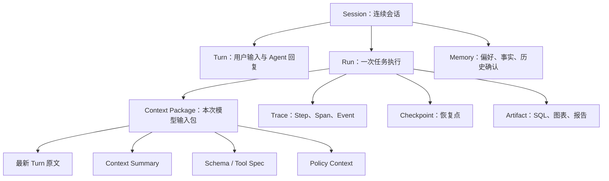

# 第38章 Agent 可观测性与运行诊断

---

Agent 的失败往往发生在最终回答之前：Context Package 漏了约束，Planner 选错了工具，SQL 参数不完整，Policy 拒绝了一次调用，下游超时，或报告引用了错误 Artifact。用户最后只看到一句“答案不对”或“任务失败”，如果平台只有普通日志，工程团队很容易把所有问题都归结为“模型不稳定”。

可观测性的任务，是把一次 Run 的上下文、决策、工具、状态、成本和产物串成一条可查询的证据链。它不要求把所有 Prompt、数据和模型中间文本永久保存，而是要求任何关键动作都能通过稳定 ID、版本、摘要、hash 和引用重新找到。

**Trace 不是“把日志记得更全”，而是让一次 Run 的上下文、决策、工具、副作用和 Artifact 能被同一组稳定标识重新串起来。**

## 38.1 Session、Run、Context Package、Trace、Checkpoint 与 Artifact

这些对象面向不同问题，不能合并成一张“大日志表”。



*表38-1：运行对象的职责边界。来源：本书整理。*

| 对象 | 主要职责 | 不能替代什么 |
|---|---|---|
| Session / Turn | 用户连续交互与前端回看 | 不能替代执行轨迹 |
| Run | 一次有终态的任务 | 不等于整个会话 |
| Context Package | 记录模型当时实际看见什么 | 不等于完整聊天历史 |
| Trace | Step / Span / Event 时间线 | 不等于纯文本日志 |
| Checkpoint | 中断恢复所需状态 | 不等于长期 Memory |
| Artifact | SQL、数据、图表、报告等业务产物 | 不应把正文全部塞进 Trace |

Context Package 特别重要。模型实际看到的通常只是最新 Turn、历史摘要、少量 Memory、检索证据、ToolSpec 和 Policy Context，而不是完整 Session。用户追问后系统答错，排查时首先要看的是这次模型调用的 Context Package，而不是把整个聊天记录重新读一遍。

这些对象的生命周期也不同：Checkpoint 只需支撑恢复窗口，Trace 受诊断/审计策略保留，Artifact 可能随正式报告长期归档，Session 则受产品和隐私规则约束。

**模型“知道过什么”与系统“历史上保存过什么”不是同一件事；只有 Context Package 能证明某一轮决策时模型真正获得了哪些材料。**

## 38.2 一次 Run 最少要留下哪些证据


*图38-1：Agent 运行轨迹采集示意图。来源：本书自绘。Alt text：一次 Run 沿执行流在创建、规划、工具调用、状态迁移等点埋下采集探针，数据汇入 trace 后端，箭头表示观测数据从执行各环节统一收集。*

*表38-2：Run 采集点与最小证据。来源：本书整理。*

| 采集点 | 最小证据 | 主要用途 |
|---|---|---|
| Run 启动 | `run_id`、`session_id`、tenant、agent、task type | 确认任务来源和影响面 |
| Context 组装 | source refs、summary version、token 估算、是否进入模型 | 判断模型看见了什么 |
| Model Call | model/prompt version、输入输出摘要、token、延迟 | 质量、成本、路由分析 |
| Tool Call | tool/version、参数摘要、Policy、结果/错误、耗时 | 副作用与失败定位 |
| State Event | 状态迁移、重试、HITL、取消、降级 | 还原 Runtime 行为 |
| Artifact 写入 | artifact id、type、hash、source、权限 | 报告与证据回放 |

跨系统关联键应长期稳定，例如：

```text
run_id
trace_id
span_id
step_id
tool_call_id
artifact_id
tenant_id
```

Agent、前端、Gateway、Tool、DataAgent、Eval 和审计都依赖这些键。字段名可以扩展，但核心语义不应随某个框架升级而漂移。

OpenTelemetry 可以作为通用骨架：Model Call、检索、SQL、Python、MCP、报告生成等映射为 Span；状态变化、重试、审批、缓存命中和错误映射为 Event。大对象仍放 Artifact/Object Store，Trace 保存引用。

**可观测性首先需要稳定的“关联语言”。没有稳定 ID 和事件语义，再多日志也只是分散的局部事实。**

## 38.3 Trace 不应成为第二份敏感数据仓库

完整 Prompt、SQL 结果、客户明细、合同、工具返回和用户上传文件都可能含敏感内容。为了排障把它们无差别复制到 Trace 后端，会制造新的数据副本和访问风险。

更稳的默认策略是：

- 运行元数据和错误码直接存 Trace；
- 文本只保存必要摘要、分类和 hash；
- SQL/Tool 参数按字段级规则脱敏；
- 大结果保存 `artifact_id` / `result_ref`；
- 高敏原文进入加密、短期、受控存储；
- 查看受控详情本身也写审计日志。

可见性可以按角色分层：

*表38-3：Trace 的角色视图。来源：本书整理。*

| 角色 | 主要需要 | 通常不需要 |
|---|---|---|
| 工程 / SRE | Span、错误码、版本、参数摘要、延迟 | 无关业务明细 |
| 业务 owner | 用户目标、关键证据、Artifact、审批、最终状态 | 内部 Prompt 技巧和错误栈 |
| 安全 / 合规 | 权限、数据域、外部调用、审批、证据链 | 普通低风险调试细节 |

访问控制不能因为“是在排障”就放宽。谁查看过原始 Tool Result、谁导出过 Artifact，也应进入访问日志。

采样同样按风险设计：普通成功 Run 可以低比例保留详细 Span；新版本/灰度提高成功采样；失败、超时、人工接管、用户点踩、高成本和高风险写操作应高保真保留。

## 38.4 前端时间线与后台 Trace：两种视图，一组事实

前端用户更适合看到稳定业务阶段：

```text
理解需求 → 查询数据 → 分析结果 → 生成报告 → 等待审批 → 完成
```

后台可能细分为 Schema Linking、SQL 生成、AST 校验、Policy、OLAP、Python、Chart Renderer、Artifact Write 等。两者粒度不同，但必须能互相映射。

用户反馈“查询数据卡住”，工程师应能从前端事件中的 `run_id/step_id` 一跳进入对应 Trace；后台产生 `waiting_human`，前端也不能继续显示“正在生成”。

前端操作本身也是 Trace 的一部分：取消、补充条件、点击重新生成、批准报告、下载 Artifact、点踩等都会改变运行或质量判断。

**前端时间线负责把状态讲给用户听，后台 Trace 负责把状态证明给工程团队看；两者如果使用不同事实源，事故时一定会互相矛盾。**

## 38.5 多轮上下文与历史 Run 怎样回放

多轮问题最常见的隐性错误，是摘要或 Memory 把旧约束带错了。回放一条 Run 时，应能看到本轮 Context Package 中每个 item：

```text
source_id
source_type
source_version
included / excluded
summary_version
token_estimate
permission_scope
```

Context Summary 与 Memory 必须分开：Summary 来自当前 Session 的压缩历史；Memory 可能跨 Session，并有独立的写入、过期和删除规则。

历史 Run 还必须按**当时版本**解释：

```text
model_version
prompt_version
tool_spec_version
semantic_layer_version
policy_version
memory_policy_version
report_template_version
```

今天工具已经升级，并不意味着昨天的 Trace 应按新 schema 重新解释。

**回放的目标是还原当时发生了什么，不是用今天的模型和数据重跑一遍。**

如果要验证修复，可以创建新的 debug/replay Run，并关联原 `run_id`；新 Trace 与旧 Trace 并排比较，但不能覆盖原始记录。涉及写操作的步骤默认不重新执行，除非进入明确沙箱或模拟环境。

## 38.6 从“答案错了”定位到具体责任层

用户的症状通常很粗，Trace 要把它拆成可修复类别。

*表38-4：失败类别与修复方向。来源：本书整理。*

| 失败类别 | 典型 Trace 信号 | 主要修复方向 |
|---|---|---|
| 上下文 | Summary 漏约束、错误 Memory | Context Builder / Memory |
| 意图/Planner | task type 或停止条件错误 | Planner / 澄清样本 |
| Schema Linking | Metric、表列或版本选错 | 语义层 / Glossary / Linker |
| Tool 选择 | 调错工具、缺必要工具 | ToolSpec 描述 / 候选裁剪 |
| 参数 | schema/SQL/API 参数错误 | Planner + Tool 错误回灌 |
| 下游 | 超时、5xx、熔断、资源不足 | 重试/容量/降级 |
| 权限 | Policy deny、越权请求 | Policy / 产品引导 / HITL |
| 成本 | 循环、长上下文、宽查询 | 预算/缓存/路由/步数限制 |

“模型幻觉”不是一个足够好的事故分类。SQL 口径错可能来自语义层，工具失败可能来自 API，回答遗漏可能来自 Context Package。只有归因到责任层，下一次发布才能验证修复是否有效。

诊断路径通常是：指标发现异常 → 找代表 Run → 看失败 Step → 查看当时 Context / Tool / Policy / Artifact → 判断根因 → 转为修复样本。

技术错误码还应有用户可读映射。例如内部 `SCHEMA_LINKING_AMBIGUOUS`，前端可以展示“销售额存在运营 GMV 和财务收入口径，请选择”。

## 38.7 Trace → Eval → 修复：把线上运行变成 AgentOps 资产

Trace 的更大价值，是让线上失败不再只是一次排障。可以形成：

```text
真实 Run
  → 异常/高价值样本筛选
  → 脱敏与证据最小化
  → 失败分类
  → Benchmark / Regression / Safety 样本
  → 修复 Prompt / Tool / Semantic / Policy / UX
  → 离线回归
  → 灰度上线
  → 新 Trace 验证
```

值得进入样本池的不只是失败：高成本成功、人工大幅修改报告、HITL 驳回、用户连续追问、降级完成，也能暴露“看起来成功但运营代价很高”的问题。

线上 Trace 不应原样复制进 Benchmark。样本可以分层保存：任务结构和期望行为、脱敏后的必要工具结果、以及只有授权时才可回查的原始 EvidenceRef。

新模型、新 Prompt、新工具和新语义层发布时，可以临时提高相关 Trace 采样比例；稳定后降低普通成功样本的详细保留，但持续保留异常路径。

**AgentOps 的最小闭环不是“线上发现问题然后改 Prompt”，而是每个问题都有原 Trace、失败类别、修复变更、回归样本和上线后的新证据。**

## 38.8 Trace 自身也需要版本、质量和发布门禁

Trace 是 Eval、成本、安全、客服和审计的上游数据，因此它本身也是平台契约。

关键字段要有字典：含义、来源、类型、敏感等级、保留期、消费者。字段新增/改名/枚举变化需要兼容窗口；历史 Run 缺失新字段时，应显示“版本当时不存在”，而不是被误判为事件没有发生。

Trace 质量可以用抽样验收：

1. 能否关联用户任务与前端事件；
2. 能否还原状态和 Tool Call；
3. 能否定位失败原因；
4. EvidenceRef/Artifact 是否可回查；
5. 隐私字段是否按规则脱敏；
6. 高风险路径是否完整记录审批和 Policy。

新 Tool、新 Runtime 事件、新前端卡片、新报告模板都可能破坏证据链，因此发布时也应跑 Trace 验收样本。

事故分级后，高风险 Trace 还应被冻结，避免普通采样/清理策略删掉关键证据；复盘后将样本、规则和责任 owner 回写平台。

**可观测系统不是 Agent 的旁路日志，而是评测、成本、安全和运营共同依赖的运行账本；账本本身不可信，后续所有治理都会失真。**

## 本章小结

Agent 可观测性的核心是把 Session、Run、Context Package、Trace、Checkpoint 和 Artifact 分开建模，再用稳定 ID 和版本将它们关联。Trace 默认保存结构化元数据、摘要、hash 和引用，而不是复制所有敏感原文。

回放要还原“当时模型看到了什么、实际执行了什么、产物来自哪里”，不能用今天的配置重写历史。前端时间线、后台 Span、用户反馈、Eval 和事故复盘应共用同一组运行事实。

**当用户说“这个回答为什么错了”时，一个成熟平台不需要猜测模型心里发生了什么，而能够沿 Trace 明确定位到上下文、规划、工具、数据、权限、成本或产物中的具体责任点。**

## 参考文献

OpenTelemetry. (n.d.). *Documentation*. https://opentelemetry.io/docs/

OpenTelemetry. (n.d.). *Semantic conventions for generative AI systems*. https://opentelemetry.io/docs/specs/semconv/gen-ai/

Langfuse. (n.d.). *Documentation*. https://langfuse.com/docs

Arize Phoenix. (n.d.). *Documentation*. https://docs.arize.com/phoenix
